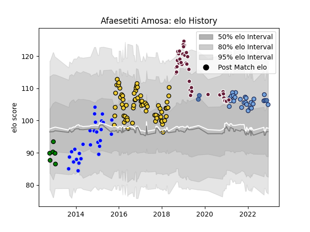

---  
layout: page  
title: Afaesetiti Amosa  
date: 2022-12-18 16:38:03.007726  
categories: player  
---
# Afaesetiti Amosa

## Positions: N8, FL

## Country: Samoa

## Current elo: 105.0

## Current Percentile: 81.0

# Elo History

# Match History

| Team               |   Appearances |   Win Rate |
|:-------------------|--------------:|-----------:|
| La Rochelle        |            65 |   0.561538 |
| Bordeaux Begles    |            39 |   0.512821 |
| Colomiers          |            28 |   0.464286 |
| Bayonne            |            27 |   0.518519 |
| Bizkaia Gernika RT |             6 |   0.333333 |
| Samoa              |             4 |   0.75     |

| Opponent             |   Matches |   Win Rate |
|:---------------------|----------:|-----------:|
| Stade Francais Paris |        11 |   0.454545 |
| Agen                 |        10 |   0.65     |
| Pau                  |        10 |   0.5      |
| Montpellier Herault  |         9 |   0.5      |
| Castres Olympique    |         9 |   0.555556 |
| Lyon                 |         9 |   0.444444 |
| Bordeaux Begles      |         7 |   0.428571 |
| Stade Toulousain     |         7 |   0.285714 |
| Toulon               |         7 |   0.785714 |
| Racing 92            |         6 |   0.5      |
| Perpignan            |         6 |   0.583333 |
| Clermont Auvergne    |         6 |   0.416667 |
| La Rochelle          |         5 |   0.4      |
| Oyonnax              |         5 |   0.5      |
| Carcassonne          |         4 |   0.75     |
| Narbonne             |         4 |   1        |
| Aurillac             |         4 |   0.5      |
| Brive                |         4 |   0.25     |
| Montauban            |         3 |   0.666667 |
| Mont-de-Marsan       |         3 |   0.666667 |
| Bayonne              |         3 |   1        |
| Grenoble             |         3 |   0.666667 |
| Harlequins           |         2 |   1        |
| Bourgoin-Jallieu     |         2 |   0.5      |
| Benetton Treviso     |         2 |   1        |
| Scarlets             |         2 |   0        |
| Rovigo               |         2 |   1        |
| Beziers              |         2 |   0        |
| Worcester Warriors   |         2 |   0        |
| Dax                  |         2 |   0.5      |
| Connacht             |         2 |   0        |
| Albi                 |         2 |   0        |
| Colomiers            |         1 |   1        |
| Massy                |         1 |   1        |
| Wasps                |         1 |   0        |
| Ulster               |         1 |   0        |
| US Bressane          |         1 |   1        |
| Australia            |         1 |   0        |
| Tarbes               |         1 |   1        |
| Gloucester Rugby     |         1 |   0        |
| Sale Sharks          |         1 |   0        |
| Russia               |         1 |   1        |
| Georgia              |         1 |   1        |
| Nevers               |         1 |   0.5      |
| Provence Rugby       |         1 |   0        |
| Romania              |         1 |   1        |