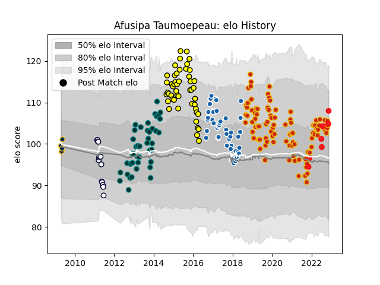

---  
layout: page  
title: Afusipa Taumoepeau  
date: 2023-02-02 18:46:48.432284  
categories: player  
---
# Afusipa Taumoepeau

## Positions: C, W

## Country: Tonga

## Current elo: 100.0

## Current Percentile: 57.0

# Elo History

# Match History

| Team              |   Appearances |   Win Rate |
|:------------------|--------------:|-----------:|
| Perpignan         |           101 |   0.430693 |
| Castres Olympique |            51 |   0.558824 |
| Albi              |            50 |   0.52     |
| Pau               |            50 |   0.67     |
| Melbourne Rebels  |            15 |   0.2      |
| Tonga             |             8 |   0.5      |
| Brumbies          |             5 |   0.6      |

| Opponent                   |   Matches |   Win Rate |
|:---------------------------|----------:|-----------:|
| Lyon                       |        11 |   0.363636 |
| La Rochelle                |        11 |   0.363636 |
| Aurillac                   |        10 |   0.8      |
| Colomiers                  |        10 |   0.7      |
| Montpellier Herault        |         9 |   0.333333 |
| Beziers                    |         9 |   0.5      |
| Biarritz Olympique         |         9 |   0.777778 |
| Racing 92                  |         9 |   0.444444 |
| Stade Francais Paris       |         9 |   0.333333 |
| Carcassonne                |         9 |   0.722222 |
| Toulon                     |         8 |   0.5      |
| Mont-de-Marsan             |         8 |   0.375    |
| Pau                        |         8 |   0.125    |
| Dax                        |         8 |   0.6875   |
| Stade Toulousain           |         8 |   0.625    |
| Clermont Auvergne          |         8 |   0.25     |
| Brive                      |         8 |   0.5      |
| Bordeaux Begles            |         8 |   0.6875   |
| Montauban                  |         7 |   0.428571 |
| Narbonne                   |         7 |   0.571429 |
| Tarbes                     |         6 |   0.666667 |
| Grenoble                   |         6 |   0.5      |
| Oyonnax                    |         6 |   0.666667 |
| Agen                       |         6 |   0.333333 |
| Provence Rugby             |         5 |   0.6      |
| Bourgoin-Jallieu           |         4 |   0.5      |
| Castres Olympique          |         4 |   0.25     |
| Soyaux-Angouleme           |         4 |   1        |
| Bayonne                    |         4 |   0.375    |
| Rouen                      |         3 |   0.333333 |
| Perpignan                  |         3 |   0.666667 |
| Vannes                     |         3 |   1        |
| Auch                       |         3 |   0.666667 |
| Queensland Reds            |         3 |   0.333333 |
| Valence Romans Drome Rugby |         2 |   1        |
| US Bressane                |         2 |   1        |
| Munster                    |         2 |   0.25     |
| Massy                      |         2 |   1        |
| Albi                       |         2 |   1        |
| Glasgow Warriors           |         2 |   0        |
| Blues                      |         2 |   0.5      |
| Brumbies                   |         2 |   0.5      |
| Bulls                      |         2 |   0.5      |
| Chiefs                     |         2 |   0        |
| Connacht                   |         2 |   0        |
| Western Force              |         2 |   0.5      |
| Hurricanes                 |         2 |   0.5      |
| Périgueux                  |         1 |   1        |
| New South Wales Waratahs   |         1 |   0        |
| Northampton Saints         |         1 |   0        |
| Uruguay                    |         1 |   1        |
| Leinster                   |         1 |   0.5      |
| Cheetahs                   |         1 |   0        |
| Leicester Tigers           |         1 |   0        |
| Stormers                   |         1 |   0        |
| Chile                      |         1 |   1        |
| Spain                      |         1 |   1        |
| Highlanders                |         1 |   0        |
| England                    |         1 |   0        |
| Sharks                     |         1 |   0        |
| Samoa                      |         1 |   0        |
| Nevers                     |         1 |   0        |
| Roval Drome XV             |         1 |   1        |
| Fiji                       |         1 |   0        |
| Romania                    |         1 |   0        |
| Hong Kong                  |         1 |   1        |
| Sale Sharks                |         1 |   0        |