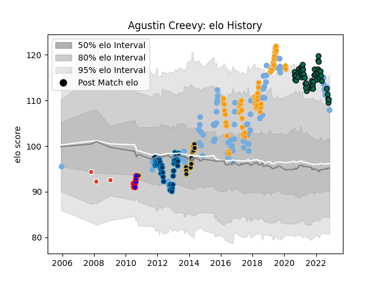

---  
layout: page  
title: Agustin Creevy  
date: 2022-12-18 16:16:37.884886  
categories: player  
---
# Agustin Creevy

## Positions: H

## Country: Argentina

## Current elo: 106.0

## Current Percentile: 87.0

# Elo History

# Match History

| Team                |   Appearances |   Win Rate |
|:--------------------|--------------:|-----------:|
| Argentina           |            84 |   0.27381  |
| Jaguares            |            59 |   0.542373 |
| London Irish        |            54 |   0.416667 |
| Montpellier Herault |            40 |   0.6125   |
| Worcester Warriors  |            13 |   0.153846 |
| San Luis            |             9 |   0.333333 |
| Biarritz Olympique  |             3 |   0.5      |
| Clermont Auvergne   |             3 |   0.333333 |

| Opponent                 |   Matches |   Win Rate |
|:-------------------------|----------:|-----------:|
| Australia                |        16 |   0.1875   |
| South Africa             |        15 |   0.2      |
| New Zealand              |        15 |   0        |
| Sale Sharks              |         9 |   0.333333 |
| Sharks                   |         8 |   0.375    |
| Scotland                 |         8 |   0.375    |
| Lions                    |         7 |   0.428571 |
| Leicester Tigers         |         6 |   0.166667 |
| Bulls                    |         6 |   0.666667 |
| Newcastle Falcons        |         6 |   0.833333 |
| Harlequins               |         6 |   0.25     |
| Gloucester Rugby         |         6 |   0.416667 |
| Exeter Chiefs            |         6 |   0.333333 |
| England                  |         6 |   0        |
| Worcester Warriors       |         6 |   0.5      |
| Bath Rugby               |         6 |   0.333333 |
| Stormers                 |         5 |   0.4      |
| Wasps                    |         5 |   0.3      |
| France                   |         5 |   0.4      |
| Brumbies                 |         4 |   0.75     |
| Saracens                 |         4 |   0.375    |
| Bristol Rugby            |         4 |   0.375    |
| Wales                    |         4 |   0        |
| Castres Olympique        |         4 |   0.25     |
| Biarritz Olympique       |         4 |   0.75     |
| Stade Toulousain         |         3 |   0.333333 |
| Stade Francais Paris     |         3 |   1        |
| Southern Kings           |         3 |   0.666667 |
| New South Wales Waratahs |         3 |   1        |
| Toulon                   |         3 |   0.333333 |
| Bayonne                  |         3 |   0.666667 |
| Racing 92                |         3 |   0.333333 |
| Queensland Reds          |         3 |   0.666667 |
| Perpignan                |         3 |   0.666667 |
| Northampton Saints       |         3 |   0        |
| Agen                     |         3 |   0.666667 |
| Georgia                  |         3 |   1        |
| Crusaders                |         3 |   0        |
| Clermont Auvergne        |         3 |   0.333333 |
| Hurricanes               |         3 |   0.333333 |
| Ireland                  |         3 |   0.333333 |
| Chiefs                   |         3 |   0.666667 |
| Italy                    |         2 |   1        |
| Bordeaux Begles          |         2 |   1        |
| Highlanders              |         2 |   0        |
| Sunwolves                |         2 |   0.5      |
| Tonga                    |         2 |   1        |
| Cheetahs                 |         2 |   1        |
| Melbourne Rebels         |         2 |   1        |
| Blues                    |         2 |   1        |
| Leinster                 |         2 |   0.25     |
| United States of America |         1 |   1        |
| Bourgoin-Jallieu         |         1 |   0        |
| Cardiff Blues            |         1 |   1        |
| Edinburgh                |         1 |   1        |
| Western Force            |         1 |   0        |
| Brive                    |         1 |   1        |
| Alumni                   |         1 |   0        |
| Atlético del Rosario     |         1 |   1        |
| Japan                    |         1 |   1        |
| Romania                  |         1 |   1        |
| Samoa                    |         1 |   0        |
| Grenoble                 |         1 |   1        |
| SIC                      |         1 |   0        |
| La Plata                 |         1 |   0        |
| Hindu                    |         1 |   0        |
| Pau                      |         1 |   1        |
| Olivos                   |         1 |   0        |
| Newman                   |         1 |   1        |
| Belgrano                 |         1 |   0        |
| CASI                     |         1 |   1        |
| Montpellier Herault      |         1 |   0        |
| Mont-de-Marsan           |         1 |   1        |
| Lyon                     |         1 |   1        |
| Albi                     |         1 |   0.5      |
| Namibia                  |         1 |   1        |