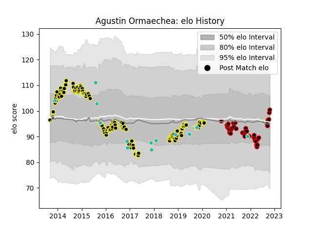

---  
layout: page  
title: Agustin Ormaechea  
date: 2023-03-17 17:32:24.220246  
categories: player  
---
# Agustin Ormaechea

## Positions: SH

## Country: Uruguay

## Current elo: 100.0

## Current Percentile: 60.0

# Elo History

# Match History

| Team           |   Appearances |   Win Rate |
|:---------------|--------------:|-----------:|
| Mont-de-Marsan |           119 |   0.529412 |
| Nice           |            38 |   0.565789 |
| Uruguay        |            23 |   0.391304 |

| Opponent                   |   Matches |   Win Rate |
|:---------------------------|----------:|-----------:|
| Aurillac                   |        12 |   0.5      |
| Bourgoin-Jallieu           |        11 |   0.545455 |
| Dax                        |        10 |   0.5      |
| Carcassonne                |         9 |   0.555556 |
| Albi                       |         9 |   0.833333 |
| Tarbes                     |         9 |   0.666667 |
| Montauban                  |         9 |   0.666667 |
| Massy                      |         7 |   0.714286 |
| Narbonne                   |         7 |   0.428571 |
| Beziers                    |         7 |   0.714286 |
| Biarritz Olympique         |         6 |   0.333333 |
| Colomiers                  |         6 |   0.5      |
| Agen                       |         5 |   0        |
| US Bressane                |         4 |   0.75     |
| Perpignan                  |         4 |   0.5      |
| Soyaux-Angouleme           |         4 |   0        |
| Provence Rugby             |         4 |   0.75     |
| Fiji                       |         3 |   0.333333 |
| Oyonnax                    |         3 |   0.333333 |
| Pau                        |         3 |   0.5      |
| Vannes                     |         3 |   0.666667 |
| Bayonne                    |         3 |   0.5      |
| Romania                    |         3 |   0.666667 |
| Chambery                   |         3 |   0.666667 |
| Spain                      |         3 |   0.333333 |
| Suresnes                   |         3 |   1        |
| Valence Romans Drome Rugby |         3 |   0        |
| Aubenas                    |         3 |   1        |
| Nevers                     |         2 |   0        |
| Wales                      |         2 |   0        |
| Namibia                    |         2 |   1        |
| Japan                      |         2 |   0        |
| Dijon                      |         2 |   0.5      |
| Cognac Saint Jean d'Angély |         2 |   0.5      |
| Australia                  |         2 |   0        |
| Lyon                       |         1 |   0        |
| La Rochelle                |         1 |   0        |
| Italy                      |         1 |   0        |
| England                    |         1 |   0        |
| Canada                     |         1 |   1        |
| Brive                      |         1 |   0        |
| Brazil                     |         1 |   1        |
| Auch                       |         1 |   1        |
| Argentina                  |         1 |   1        |
| Georgia                    |         1 |   0        |