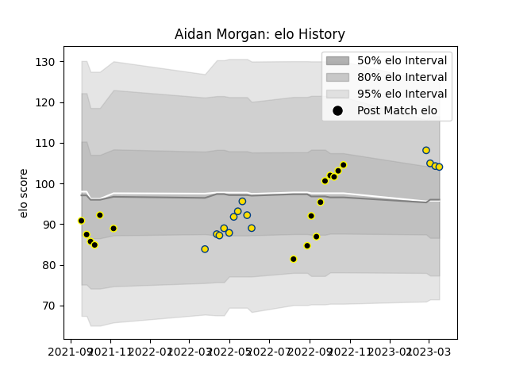

---  
layout: page  
title: Aidan Morgan  
date: 2023-03-21 18:39:24.675508  
categories: player  
---
# Aidan Morgan

Last updated: 2023-03-21
## Positions: FH

## Current elo: 104.0

## Current Percentile: 71.0

# Elo History

# Match History

| Team       |   Appearances |   Win Rate |
|:-----------|--------------:|-----------:|
| Wellington |            16 |   0.75     |
| Hurricanes |            14 |   0.642857 |

| Opponent                 |   Matches |   Win Rate |
|:-------------------------|----------:|-----------:|
| Hawke's Bay              |         3 |   0.666667 |
| Melbourne Rebels         |         2 |   1        |
| Brumbies                 |         2 |   0        |
| Canterbury               |         2 |   1        |
| Taranaki                 |         2 |   0.5      |
| Queensland Reds          |         2 |   1        |
| Bay of Plenty            |         2 |   0.5      |
| Moana Pasifika           |         2 |   0.5      |
| New South Wales Waratahs |         2 |   1        |
| Otago                    |         1 |   1        |
| Waikato                  |         1 |   1        |
| Tasman                   |         1 |   0        |
| Southland                |         1 |   1        |
| Auckland                 |         1 |   1        |
| Manawatu                 |         1 |   1        |
| Highlanders              |         1 |   1        |
| Fijian Drua              |         1 |   1        |
| Counties Manukau         |         1 |   1        |
| Blues                    |         1 |   0        |
| Western Force            |         1 |   0        |