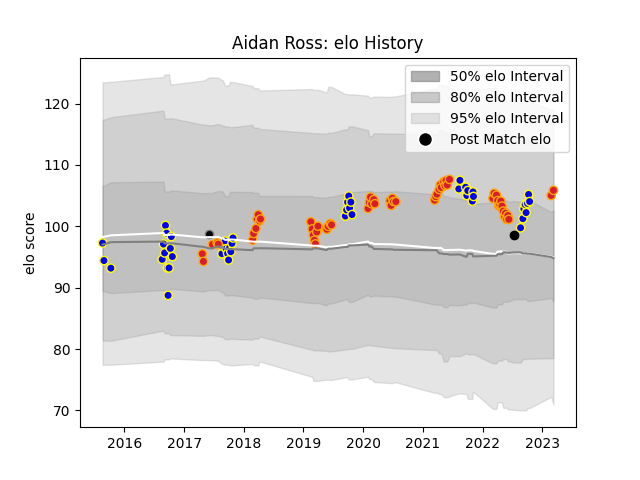

---  
layout: page  
title: Aidan Ross  
date: 2023-03-21 18:25:57.532494  
categories: player  
---
# Aidan Ross

Last updated: 2023-03-21
## Positions: P

## Country: New Zealand

## Current elo: 107.0

## Current Percentile: 80.0

# Elo History

# Match History

| Team                |   Appearances |   Win Rate |
|:--------------------|--------------:|-----------:|
| Chiefs              |            64 |   0.601562 |
| Bay of Plenty       |            47 |   0.521277 |
| New Zealand         |             1 |   0        |
| Provincial Union XV |             1 |   0        |

| Opponent                 |   Matches |   Win Rate |
|:-------------------------|----------:|-----------:|
| Crusaders                |        13 |   0.384615 |
| Blues                    |         8 |   0.5      |
| Hurricanes               |         7 |   0.5      |
| Hawke's Bay              |         6 |   0.833333 |
| Otago                    |         6 |   0.5      |
| Highlanders              |         6 |   0.5      |
| Waikato                  |         5 |   0.4      |
| Southland                |         4 |   0.75     |
| Manawatu                 |         4 |   1        |
| Northland                |         4 |   0.75     |
| New South Wales Waratahs |         4 |   1        |
| Sunwolves                |         4 |   0.75     |
| Taranaki                 |         4 |   0.25     |
| Brumbies                 |         4 |   0.25     |
| Queensland Reds          |         3 |   0.666667 |
| Wellington               |         3 |   0.333333 |
| Auckland                 |         3 |   0.333333 |
| Melbourne Rebels         |         3 |   1        |
| Western Force            |         3 |   1        |
| North Harbour            |         2 |   0.5      |
| Moana Pasifika           |         2 |   1        |
| Jaguares                 |         2 |   0.5      |
| Counties Manukau         |         2 |   0.25     |
| Canterbury               |         2 |   0        |
| Tasman                   |         2 |   0        |
| Bulls                    |         2 |   1        |
| British and Irish Lions  |         2 |   0        |
| Ireland                  |         1 |   0        |
| Fijian Drua              |         1 |   1        |
| Stormers                 |         1 |   1        |