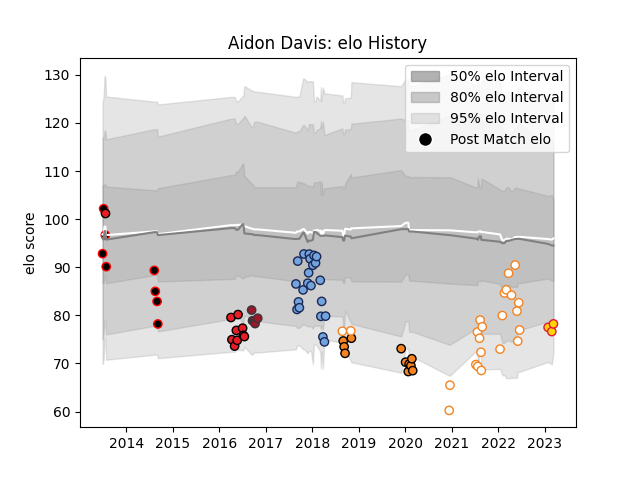

---  
layout: page  
title: Aidon Davis  
date: 2023-01-27 11:07:47.569457  
categories: player  
---
# Aidon Davis

## Positions: N8, FL

## Current elo: 86.0

## Current Percentile: 8.0

# Elo History

# Match History

| Team                   |   Appearances |   Win Rate |
|:-----------------------|--------------:|-----------:|
| Bayonne                |            22 |   0.431818 |
| Free State Cheetahs    |            21 |   0.595238 |
| Cheetahs               |            11 |   0.272727 |
| Southern Kings         |            10 |   0.2      |
| Eastern Province Kings |             8 |   0.25     |
| Toulon                 |             5 |   0.7      |

| Opponent            |   Matches |   Win Rate |
|:--------------------|----------:|-----------:|
| Western Province    |         6 |   0.333333 |
| Pumas               |         6 |   0.5      |
| Golden Lions        |         5 |   0.3      |
| Griquas             |         3 |   0.666667 |
| Blue Bulls          |         3 |   0.666667 |
| Natal Sharks        |         3 |   0.666667 |
| Grenoble            |         3 |   0.333333 |
| Beziers             |         2 |   0.5      |
| Narbonne            |         2 |   0.5      |
| Munster             |         2 |   0        |
| Mont-de-Marsan      |         2 |   0.5      |
| Sharks              |         2 |   0        |
| Jaguares            |         2 |   0.5      |
| Southern Kings      |         2 |   1        |
| Soyaux-Angouleme    |         2 |   0.5      |
| Ospreys             |         2 |   0.5      |
| Dax                 |         2 |   0.75     |
| Colomiers           |         2 |   0.5      |
| Vannes              |         2 |   0.5      |
| Nevers              |         2 |   0.5      |
| Stade Toulousain    |         1 |   1        |
| Stormers            |         1 |   0        |
| SWD Eagles          |         1 |   1        |
| Racing 92           |         1 |   0        |
| Perpignan           |         1 |   0        |
| Sunwolves           |         1 |   1        |
| Ulster              |         1 |   0        |
| Montauban           |         1 |   1        |
| Montpellier Herault |         1 |   1        |
| Biarritz Olympique  |         1 |   0        |
| Lions               |         1 |   0        |
| Leinster            |         1 |   0        |
| La Rochelle         |         1 |   0.5      |
| Highlanders         |         1 |   0        |
| Griffons            |         1 |   1        |
| Glasgow Warriors    |         1 |   0        |
| Dragons             |         1 |   0        |
| Cheetahs            |         1 |   0        |
| Carcassonne         |         1 |   0        |
| Bulls               |         1 |   0        |
| Boland Cavaliers    |         1 |   0        |
| Zebre               |         1 |   0        |