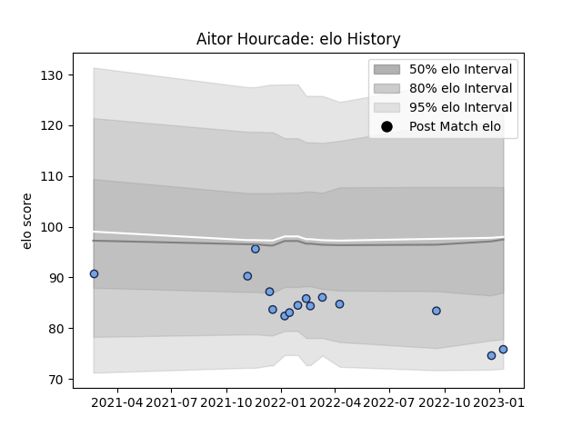

---  
layout: page  
title: Aitor Hourcade  
date: 2022-12-18 16:39:15.537967  
categories: player  
---
# Aitor Hourcade

## Positions: FL, N8

## Current elo: 80.0

## Current Percentile: 12.0

# Elo History

# Match History

| Team    |   Appearances |   Win Rate |
|:--------|--------------:|-----------:|
| Bayonne |             5 |        0.4 |

| Opponent             |   Matches |   Win Rate |
|:---------------------|----------:|-----------:|
| Benetton Treviso     |         1 |          0 |
| Clermont Auvergne    |         1 |          0 |
| Montauban            |         1 |          1 |
| Rouen                |         1 |          1 |
| Stade Francais Paris |         1 |          0 |