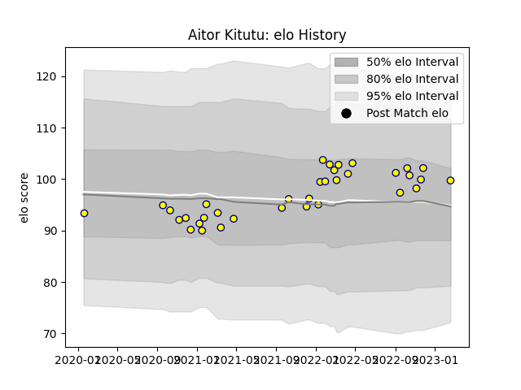

---  
layout: page  
title: Aitor Kitutu  
date: 2023-03-21 18:29:00.121453  
categories: player  
---
# Aitor Kitutu

Last updated: 2023-03-21
## Positions: P

## Current elo: 104.0

## Current Percentile: 82.0

# Elo History

# Match History

| Team   |   Appearances |   Win Rate |
|:-------|--------------:|-----------:|
| Nevers |            38 |   0.513158 |

| Opponent           |   Matches |   Win Rate |
|:-------------------|----------:|-----------:|
| Mont-de-Marsan     |         4 |   0.75     |
| Rouen              |         4 |   0.75     |
| Carcassonne        |         3 |   0.666667 |
| Provence Rugby     |         3 |   0.666667 |
| Colomiers          |         3 |   0.333333 |
| Vannes             |         3 |   0        |
| Beziers            |         3 |   0.833333 |
| Biarritz Olympique |         2 |   0.75     |
| Aurillac           |         2 |   0        |
| Oyonnax            |         2 |   0        |
| Bayonne            |         2 |   0.25     |
| Soyaux-Angouleme   |         2 |   1        |
| Grenoble           |         1 |   0        |
| Montauban          |         1 |   0        |
| Narbonne           |         1 |   1        |
| Perpignan          |         1 |   0        |
| Agen               |         1 |   1        |