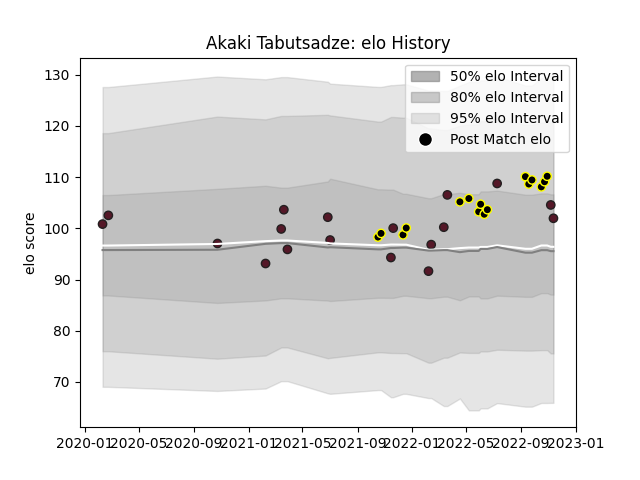

---  
layout: page  
title: Akaki Tabutsadze  
date: 2023-02-05 15:08:15.741027  
categories: player  
---
# Akaki Tabutsadze

## Positions: W

## Country: Georgia

## Current elo: 110.0

## Current Percentile: 71.0

# Elo History

# Match History

| Team       |   Appearances |   Win Rate |
|:-----------|--------------:|-----------:|
| Georgia    |            19 |   0.736842 |
| Black Lion |            17 |   0.794118 |

| Opponent                 |   Matches |   Win Rate |
|:-------------------------|----------:|-----------:|
| Tel-Aviv Heat            |         4 |      0.625 |
| Spain                    |         3 |      1     |
| Netherlands              |         2 |      1     |
| Castilla y Leon Iberians |         2 |      1     |
| Russia                   |         2 |      1     |
| Romanian Wolves          |         2 |      1     |
| Romania                  |         2 |      1     |
| RC Batumi                |         2 |      1     |
| Portugal                 |         1 |      0.5   |
| South Africa             |         1 |      0     |
| Scotland                 |         1 |      0     |
| Samoa                    |         1 |      0     |
| SWD Eagles               |         1 |      1     |
| Belgium                  |         1 |      1     |
| Boland Cavaliers         |         1 |      0     |
| Lusitanos XV             |         1 |      1     |
| Lokomotiv Penza          |         1 |      1     |
| Leopards                 |         1 |      1     |
| Italy                    |         1 |      1     |
| Griffons                 |         1 |      0     |
| Germany                  |         1 |      1     |
| France                   |         1 |      0     |
| Fiji                     |         1 |      0.5   |
| Enisey-STM Krasnoyarsk   |         1 |      1     |
| Uruguay                  |         1 |      1     |