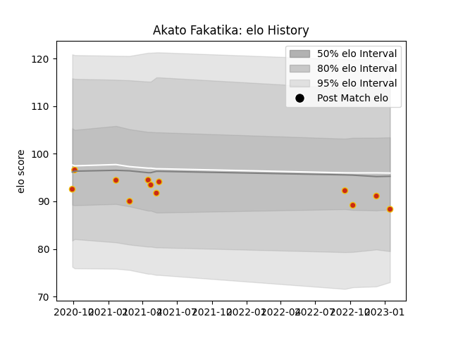

---  
layout: page  
title: Akato Fakatika  
date: 2023-01-15 11:50:37.555704  
categories: player  
---
# Akato Fakatika

## Positions: P

## Current elo: 88.0

## Current Percentile: None

# Elo History

# Match History

| Team      |   Appearances |   Win Rate |
|:----------|--------------:|-----------:|
| Perpignan |            12 |   0.583333 |

| Opponent                   |   Matches |   Win Rate |
|:---------------------------|----------:|-----------:|
| Beziers                    |         1 |          1 |
| Bristol Rugby              |         1 |          0 |
| Carcassonne                |         1 |          1 |
| Colomiers                  |         1 |          1 |
| Glasgow Warriors           |         1 |          0 |
| La Rochelle                |         1 |          0 |
| Mont-de-Marsan             |         1 |          1 |
| Nevers                     |         1 |          1 |
| Rouen                      |         1 |          0 |
| Stade Francais Paris       |         1 |          0 |
| Valence Romans Drome Rugby |         1 |          1 |
| Vannes                     |         1 |          1 |