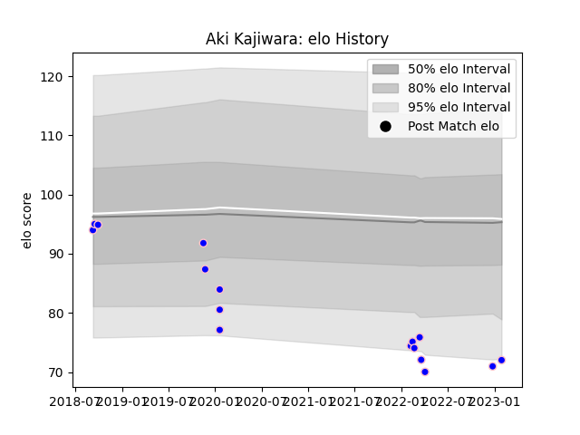

---  
layout: page  
title: Aki Kajiwara  
date: 2023-03-21 18:41:07.559351  
categories: player  
---
# Aki Kajiwara

Last updated: 2023-03-21
## Positions: P

## Current elo: 81.0

## Current Percentile: 11.0

# Elo History

# Match History

| Team              |   Appearances |   Win Rate |
|:------------------|--------------:|-----------:|
| Kurita Water Gush |            20 |       0.25 |

| Opponent                         |   Matches |   Win Rate |
|:---------------------------------|----------:|-----------:|
| Chugoku Red Regulions            |         4 |   0.75     |
| Hanazono Kintetsu Liners         |         4 |   0        |
| Kyuden Voltex                    |         3 |   0.333333 |
| NTT Docomo Red Hurricanes Osaka  |         3 |   0.333333 |
| Munakata Sanix Blues             |         2 |   0        |
| Coca-Cola Red Sparks             |         1 |   0        |
| Shimizu Blue Sharks              |         1 |   0        |
| Skyactivs Hiroshima              |         1 |   0        |
| Toyota Industries Shuttles Aichi |         1 |   0        |