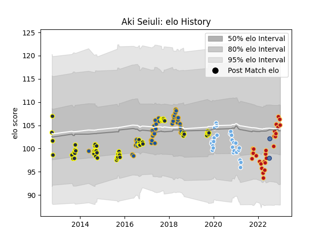

---  
layout: page  
title: Aki Seiuli  
date: 2023-02-02 18:57:44.775832  
categories: player  
---
# Aki Seiuli

## Positions: P

## Country: Samoa

## Current elo: 104.0

## Current Percentile: 79.0

# Elo History

# Match History

| Team             |   Appearances |   Win Rate |
|:-----------------|--------------:|-----------:|
| Otago            |            59 |   0.508475 |
| Highlanders      |            40 |   0.7      |
| Dragons          |            30 |   0.183333 |
| Glasgow Warriors |            26 |   0.442308 |
| Samoa            |             2 |   1        |

| Opponent                 |   Matches |   Win Rate |
|:-------------------------|----------:|-----------:|
| Wellington               |         7 |   0.285714 |
| Northland                |         7 |   0.571429 |
| Bay of Plenty            |         7 |   0.571429 |
| Hawke's Bay              |         6 |   0.166667 |
| Tasman                   |         6 |   0.333333 |
| Manawatu                 |         6 |   0.833333 |
| Lions                    |         5 |   0.2      |
| Ospreys                  |         5 |   0.4      |
| Cardiff Blues            |         5 |   0.2      |
| North Harbour            |         5 |   0.8      |
| Leinster                 |         5 |   0        |
| Hurricanes               |         5 |   0.4      |
| Edinburgh                |         5 |   0.4      |
| Stormers                 |         4 |   0.5      |
| Southland                |         4 |   0.75     |
| Scarlets                 |         4 |   0.5      |
| Auckland                 |         4 |   0.5      |
| Crusaders                |         4 |   0.25     |
| Blues                    |         4 |   1        |
| Chiefs                   |         4 |   0.5      |
| Bulls                    |         4 |   0.5      |
| Zebre                    |         3 |   0.666667 |
| Benetton Treviso         |         3 |   0.833333 |
| Dragons                  |         3 |   0.333333 |
| Ulster                   |         3 |   0        |
| Brumbies                 |         3 |   1        |
| Sharks                   |         3 |   0        |
| Munster                  |         3 |   0.333333 |
| New South Wales Waratahs |         3 |   0.333333 |
| Canterbury               |         3 |   0        |
| Glasgow Warriors         |         2 |   0        |
| Waikato                  |         2 |   1        |
| Queensland Reds          |         2 |   1        |
| Melbourne Rebels         |         2 |   1        |
| Connacht                 |         2 |   0.5      |
| La Rochelle              |         2 |   0.5      |
| Sale Sharks              |         1 |   1        |
| Cheetahs                 |         1 |   1        |
| Southern Kings           |         1 |   1        |
| British and Irish Lions  |         1 |   1        |
| Sunwolves                |         1 |   1        |
| Taranaki                 |         1 |   1        |
| Counties Manukau         |         1 |   0        |
| Tonga                    |         1 |   1        |
| Jaguares                 |         1 |   1        |
| Exeter Chiefs            |         1 |   0.5      |
| Western Force            |         1 |   1        |
| Fiji                     |         1 |   1        |