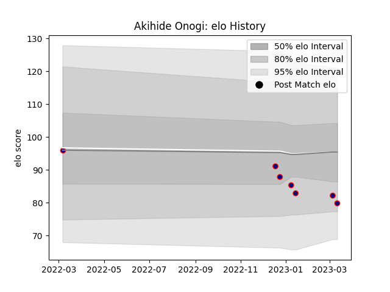

---  
layout: page  
title: Akihide Onogi  
date: 2023-03-17 17:26:31.713618  
categories: player  
---
# Akihide Onogi

## Positions: C, W

## Current elo: 80.0

## Current Percentile: 17.0

# Elo History

# Match History

| Team                     |   Appearances |   Win Rate |
|:-------------------------|--------------:|-----------:|
| Hanazono Kintetsu Liners |             7 |   0.142857 |

| Opponent                          |   Matches |   Win Rate |
|:----------------------------------|----------:|-----------:|
| Green Rockets Tokatsu             |         1 |          0 |
| Kobelco Kobe Steelers             |         1 |          0 |
| Kubota Spears Funabashi Tokyo-Bay |         1 |          0 |
| Mitsubishi Dynaboars              |         1 |          0 |
| Skyactivs Hiroshima               |         1 |          1 |
| Toyota Verblitz                   |         1 |          0 |
| Yokohama Canon Eagles             |         1 |          0 |