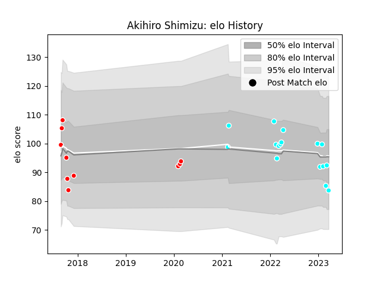

---  
layout: page  
title: Akihiro Shimizu  
date: 2023-02-02 18:56:01.957748  
categories: player  
---
# Akihiro Shimizu

## Positions: FH

## Current elo: 99.0

## Current Percentile: 43.0

# Elo History

# Match History

| Team                             |   Appearances |   Win Rate |
|:---------------------------------|--------------:|-----------:|
| Toyota Industries Shuttles Aichi |            13 |   0.923077 |
| Kobelco Kobe Steelers            |             5 |   0.8      |

| Opponent                        |   Matches |   Win Rate |
|:--------------------------------|----------:|-----------:|
| Chugoku Red Regulions           |         3 |          1 |
| Kyuden Voltex                   |         3 |          1 |
| Shimizu Blue Sharks             |         3 |          1 |
| Black Rams Tokyo                |         1 |          1 |
| Green Rockets Tokatsu           |         1 |          1 |
| Hino Red Dolphins               |         1 |          1 |
| Kamaishi Seawaves               |         1 |          1 |
| Kurita Water Gush               |         1 |          1 |
| NTT Docomo Red Hurricanes Osaka |         1 |          1 |
| Toshiba Brave Lupus Tokyo       |         1 |          1 |
| Urayasu D-Rocks                 |         1 |          0 |
| Yokohama Canon Eagles           |         1 |          0 |