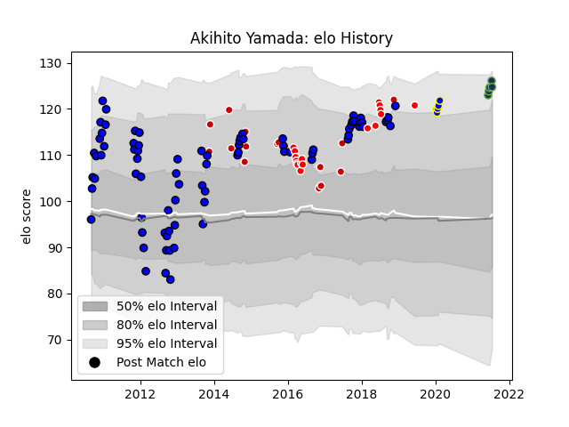

---  
layout: page  
title: Akihito Yamada  
date: 2022-12-28 12:55:15.269099  
categories: player  
---
# Akihito Yamada

## Positions: W

## Country: Japan

## Current elo: 118.0

## Current Percentile: None

# Elo History

# Match History

| Team                 |   Appearances |   Win Rate |
|:---------------------|--------------:|-----------:|
| Saitama Wild Knights |            58 |   0.818966 |
| Japan                |            16 |   0.5625   |
| Sunwolves            |            16 |   0.15625  |
| Urayasu D-Rocks      |             5 |   0.6      |
| Seattle Seawolves    |             4 |   0.25     |
| Kyuden Voltex        |             1 |   1        |

| Opponent                          |   Matches |   Win Rate |
|:----------------------------------|----------:|-----------:|
| Black Rams Tokyo                  |         7 |   0.857143 |
| Shizuoka Blue Revs                |         7 |   0.785714 |
| Munakata Sanix Blues              |         5 |   1        |
| Toshiba Brave Lupus Tokyo         |         5 |   0.6      |
| Tokyo Sungoliath                  |         5 |   0.2      |
| Kobelco Kobe Steelers             |         4 |   1        |
| Toyota Verblitz                   |         4 |   0.75     |
| Coca-Cola Red Sparks              |         4 |   1        |
| Stormers                          |         4 |   0.375    |
| Kubota Spears Funabashi Tokyo-Bay |         4 |   0.75     |
| Hanazono Kintetsu Liners          |         4 |   1        |
| Urayasu D-Rocks                   |         3 |   0.666667 |
| Yokohama Canon Eagles             |         3 |   0.666667 |
| Romania                           |         2 |   1        |
| Bulls                             |         2 |   0.5      |
| Queensland Reds                   |         2 |   0        |
| New Zealand Maori                 |         2 |   0        |
| NTT Docomo Red Hurricanes Osaka   |         2 |   1        |
| Melbourne Rebels                  |         2 |   0        |
| Samoa                             |         2 |   1        |
| Green Rockets Tokatsu             |         2 |   1        |
| Brumbies                          |         1 |   0        |
| Utah Warriors                     |         1 |   0        |
| South Africa                      |         1 |   1        |
| Cheetahs                          |         1 |   0        |
| England                           |         1 |   0        |
| Fiji                              |         1 |   0        |
| Wales                             |         1 |   0        |
| Western Force                     |         1 |   0        |
| Spain                             |         1 |   1        |
| Southern Kings                    |         1 |   0        |
| Toyota Industries Shuttles Aichi  |         1 |   1        |
| Houston SaberCats                 |         1 |   1        |
| Georgia                           |         1 |   1        |
| Russia                            |         1 |   1        |
| Ireland                           |         1 |   0        |
| New South Wales Waratahs          |         1 |   0        |
| New England Free Jacks            |         1 |   0        |
| Austin Gilgronis                  |         1 |   0        |
| Mie Honda Heat                    |         1 |   1        |
| Lions                             |         1 |   0        |
| Kyuden Voltex                     |         1 |   1        |
| Kurita Water Gush                 |         1 |   1        |
| Hino Red Dolphins                 |         1 |   1        |
| Italy                             |         1 |   1        |
| Argentina                         |         1 |   0        |