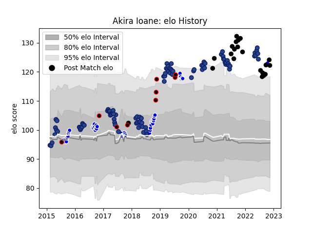

---  
layout: page  
title: Akira Ioane  
date: 2022-11-16 11:43:16.608618  
categories: player  
---
# Akira Ioane

## Positions: N8, FL

## Country: New Zealand

## Current elo: 119.0

## Current Percentile: 96.0

# Elo History

# Match History

| Team              |   Appearances |   Win Rate |
|:------------------|--------------:|-----------:|
| Blues             |            95 |   0.5      |
| Auckland          |            45 |   0.611111 |
| New Zealand       |            21 |   0.714286 |
| New Zealand Maori |             9 |   0.777778 |

| Opponent                 |   Matches |   Win Rate |
|:-------------------------|----------:|-----------:|
| Highlanders              |        14 |   0.5      |
| Chiefs                   |        12 |   0.375    |
| Hurricanes               |        12 |   0.25     |
| Crusaders                |        11 |   0        |
| Tasman                   |         7 |   0.428571 |
| New South Wales Waratahs |         6 |   1        |
| Melbourne Rebels         |         6 |   0.666667 |
| Australia                |         6 |   0.833333 |
| Queensland Reds          |         6 |   0.75     |
| Canterbury               |         6 |   0.333333 |
| Counties Manukau         |         5 |   0.6      |
| Southland                |         4 |   0.875    |
| Fiji                     |         4 |   0.75     |
| South Africa             |         4 |   0.5      |
| Brumbies                 |         4 |   0.75     |
| Otago                    |         4 |   0.5      |
| Waikato                  |         4 |   0.5      |
| Western Force            |         4 |   1        |
| Northland                |         3 |   1        |
| Stormers                 |         3 |   0.333333 |
| Sharks                   |         3 |   0.333333 |
| Sunwolves                |         3 |   0.666667 |
| Taranaki                 |         3 |   0.666667 |
| Wellington               |         3 |   0.666667 |
| Argentina                |         3 |   0.666667 |
| Jaguares                 |         3 |   0.333333 |
| Bulls                    |         3 |   0.833333 |
| North Harbour            |         2 |   1        |
| Bay of Plenty            |         2 |   1        |
| Wales                    |         2 |   1        |
| United States of America |         2 |   1        |
| British and Irish Lions  |         2 |   0.5      |
| Lions                    |         2 |   1        |
| Cheetahs                 |         2 |   0.5      |
| France                   |         2 |   0.5      |
| Hawke's Bay              |         2 |   0.5      |
| Chile                    |         1 |   1        |
| Tonga                    |         1 |   1        |
| Brazil                   |         1 |   1        |
| Scotland                 |         1 |   1        |
| Ireland                  |         1 |   0        |
| Canada                   |         1 |   1        |