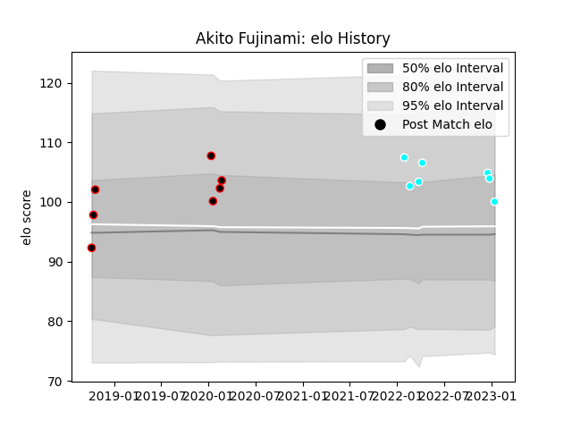

---  
layout: page  
title: Akito Fujinami  
date: 2023-03-21 18:11:45.856682  
categories: player  
---
# Akito Fujinami

Last updated: 2023-03-21
## Positions: H

## Current elo: 61.0

## Current Percentile: 2.0

# Elo History

# Match History

| Team                             |   Appearances |   Win Rate |
|:---------------------------------|--------------:|-----------:|
| Mie Honda Heat                   |            15 |   0.466667 |
| Toyota Industries Shuttles Aichi |             9 |   0.666667 |

| Opponent                          |   Matches |   Win Rate |
|:----------------------------------|----------:|-----------:|
| Urayasu D-Rocks                   |         4 |        0   |
| Kubota Spears Funabashi Tokyo-Bay |         2 |        0   |
| Munakata Sanix Blues              |         2 |        0.5 |
| Shimizu Blue Sharks               |         2 |        1   |
| Toshiba Brave Lupus Tokyo         |         2 |        0.5 |
| Yokohama Canon Eagles             |         2 |        1   |
| Black Rams Tokyo                  |         1 |        1   |
| Chugoku Red Regulions             |         1 |        1   |
| Coca-Cola Red Sparks              |         1 |        1   |
| Green Rockets Tokatsu             |         1 |        1   |
| Hino Red Dolphins                 |         1 |        1   |
| Kamaishi Seawaves                 |         1 |        1   |
| Kyuden Voltex                     |         1 |        1   |
| Mie Honda Heat                    |         1 |        0   |
| Saitama Wild Knights              |         1 |        0   |
| Tokyo Sungoliath                  |         1 |        0   |