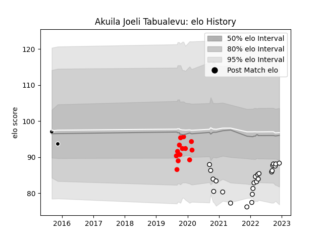

---  
layout: page  
title: Akuila Joeli Tabualevu  
date: 2023-01-15 11:56:19.019094  
categories: player  
---
# Akuila Joeli Tabualevu

## Positions: C

## Current elo: 98.0

## Current Percentile: 50.0

# Elo History

# Match History

| Team                       |   Appearances |   Win Rate |
|:---------------------------|--------------:|-----------:|
| Valence Romans Drome Rugby |            41 |   0.54878  |
| Rouen                      |            18 |   0.277778 |
| Provence Rugby             |             2 |   0        |

| Opponent                   |   Matches |   Win Rate |
|:---------------------------|----------:|-----------:|
| Soyaux-Angouleme           |         6 |   0.25     |
| Beziers                    |         4 |   0.125    |
| Oyonnax                    |         3 |   0.333333 |
| Nice                       |         3 |   1        |
| Bourgoin-Jallieu           |         3 |   0.5      |
| Cognac Saint Jean d'Angély |         3 |   1        |
| Albi                       |         2 |   0.5      |
| Perpignan                  |         2 |   0.5      |
| Nevers                     |         2 |   0.5      |
| Montauban                  |         2 |   0        |
| Mont-de-Marsan             |         2 |   0        |
| Roval Drome XV             |         2 |   1        |
| Grenoble                   |         2 |   0        |
| Rouen                      |         2 |   0.5      |
| Dax                        |         2 |   0.5      |
| Chambery                   |         2 |   1        |
| Tarbes                     |         2 |   0.5      |
| Blagnac                    |         2 |   0.5      |
| Biarritz Olympique         |         2 |   0.5      |
| Aurillac                   |         2 |   0        |
| Rennes                     |         1 |   1        |
| US Bressane                |         1 |   0        |
| Suresnes                   |         1 |   1        |
| Lyon                       |         1 |   0        |
| Provence Rugby             |         1 |   0        |
| Aubenas                    |         1 |   1        |
| Dijon                      |         1 |   0        |
| Colomiers                  |         1 |   0        |
| Carqueiranne-Hyères        |         1 |   1        |
| Carcassonne                |         1 |   1        |
| Vannes                     |         1 |   0        |