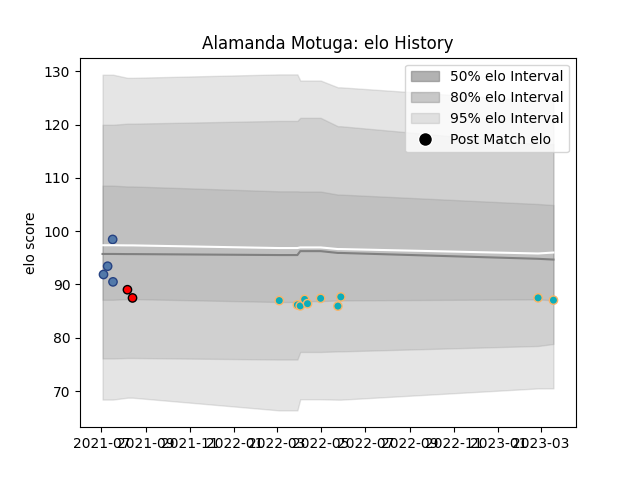

---  
layout: page  
title: Alamanda Motuga  
date: 2023-03-21 18:25:17.552966  
categories: player  
---
# Alamanda Motuga

Last updated: 2023-03-21
## Positions: FL

## Country: Samoa

## Current elo: 87.0

## Current Percentile: 26.0

# Elo History

# Match History

| Team             |   Appearances |   Win Rate |
|:-----------------|--------------:|-----------:|
| Moana Pasifika   |            10 |       0.1  |
| Samoa            |             4 |       0.75 |
| Counties Manukau |             2 |       0    |

| Opponent          |   Matches |   Win Rate |
|:------------------|----------:|-----------:|
| Tonga             |         3 |        1   |
| Blues             |         2 |        0   |
| Brumbies          |         2 |        0.5 |
| Crusaders         |         1 |        0   |
| Fijian Drua       |         1 |        0   |
| Highlanders       |         1 |        0   |
| Hurricanes        |         1 |        0   |
| Manawatu          |         1 |        0   |
| Melbourne Rebels  |         1 |        0   |
| New Zealand Maori |         1 |        0   |
| North Harbour     |         1 |        0   |
| Western Force     |         1 |        0   |