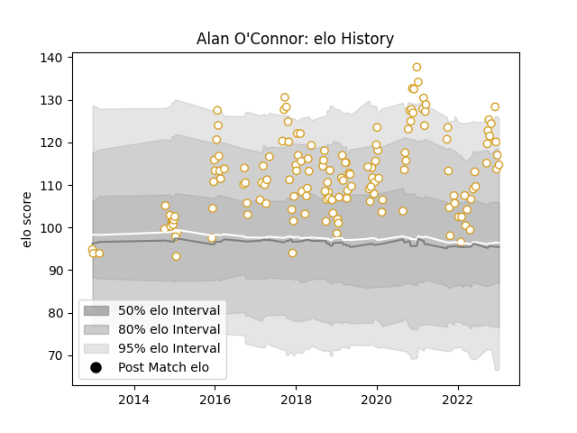

---  
layout: page  
title: Alan O'Connor  
date: 2022-12-09 13:04:26.981399  
categories: player  
---
# Alan O'Connor

## Positions: L

## Current elo: 121.0

## Current Percentile: 94.0

# Elo History

# Match History

| Team   |   Appearances |   Win Rate |
|:-------|--------------:|-----------:|
| Ulster |           147 |   0.676871 |

| Opponent          |   Matches |   Win Rate |
|:------------------|----------:|-----------:|
| Leinster          |        16 |   0.3125   |
| Munster           |        13 |   0.346154 |
| Scarlets          |        11 |   0.636364 |
| Ospreys           |        11 |   0.727273 |
| Glasgow Warriors  |        11 |   0.636364 |
| Connacht          |        11 |   0.727273 |
| Edinburgh         |        10 |   0.9      |
| Dragons           |         8 |   0.9375   |
| Zebre             |         7 |   1        |
| Benetton Treviso  |         6 |   0.916667 |
| Cardiff Blues     |         6 |   0.75     |
| Southern Kings    |         5 |   1        |
| Harlequins        |         4 |   1        |
| Leicester Tigers  |         3 |   1        |
| Stade Toulousain  |         3 |   0.666667 |
| Cheetahs          |         3 |   0.833333 |
| Racing 92         |         2 |   0.5      |
| Clermont Auvergne |         2 |   0.5      |
| Stormers          |         2 |   0        |
| Bath Rugby        |         2 |   1        |
| Lions             |         2 |   1        |
| La Rochelle       |         2 |   0.5      |
| Saracens          |         1 |   0        |
| Bordeaux Begles   |         1 |   0        |
| Sharks            |         1 |   1        |
| Oyonnax           |         1 |   1        |
| Toulon            |         1 |   0        |
| Wasps             |         1 |   0        |
| Exeter Chiefs     |         1 |   1        |