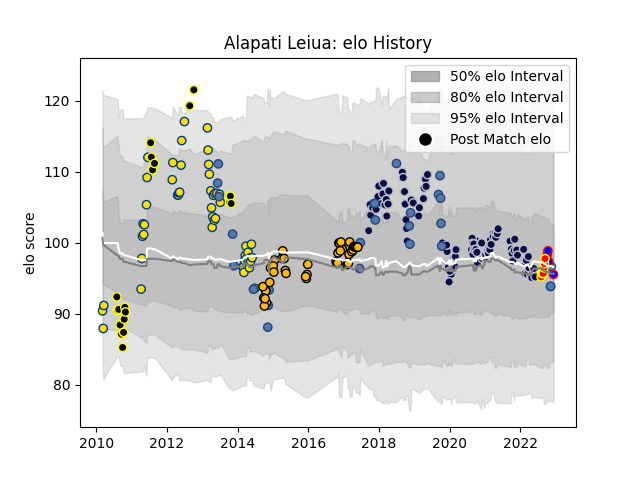

---  
layout: page  
title: Alapati Leiua  
date: 2022-12-14 11:19:39.377604  
categories: player  
---
# Alapati Leiua

## Positions: W, C

## Country: Samoa

## Current elo: 96.0

## Current Percentile: 53.0

# Elo History

# Match History

| Team          |   Appearances |   Win Rate |
|:--------------|--------------:|-----------:|
| Bristol Rugby |            97 |   0.628866 |
| Hurricanes    |            51 |   0.460784 |
| Wasps         |            43 |   0.523256 |
| Samoa         |            26 |   0.346154 |
| Wellington    |            20 |   0.6      |
| Waikato       |             7 |   0.928571 |
| Stormers      |             4 |   0.375    |

| Opponent                 |   Matches |   Win Rate |
|:-------------------------|----------:|-----------:|
| Bath Rugby               |        13 |   0.692308 |
| Harlequins               |        11 |   0.454545 |
| Sale Sharks              |        10 |   0.25     |
| Worcester Warriors       |         9 |   0.777778 |
| Leicester Tigers         |         9 |   0.555556 |
| Saracens                 |         8 |   0.375    |
| Northampton Saints       |         8 |   0.625    |
| Gloucester Rugby         |         8 |   0.75     |
| Exeter Chiefs            |         8 |   0.4375   |
| Wasps                    |         7 |   0.142857 |
| Newcastle Falcons        |         7 |   0.857143 |
| Blues                    |         6 |   0.333333 |
| Highlanders              |         6 |   0.333333 |
| Crusaders                |         6 |   0.666667 |
| London Irish             |         5 |   0.5      |
| Chiefs                   |         5 |   0.3      |
| Zebre                    |         5 |   0.7      |
| Cheetahs                 |         4 |   0.75     |
| Italy                    |         4 |   0.5      |
| Stormers                 |         4 |   0        |
| Hawke's Bay              |         4 |   0.375    |
| Auckland                 |         3 |   0.666667 |
| Georgia                  |         3 |   0.333333 |
| New South Wales Waratahs |         3 |   0.666667 |
| Bulls                    |         3 |   0.333333 |
| Brumbies                 |         3 |   0        |
| Queensland Reds          |         3 |   0.666667 |
| Scotland                 |         3 |   0.333333 |
| Taranaki                 |         3 |   1        |
| Counties Manukau         |         3 |   0.666667 |
| Manawatu                 |         3 |   0.666667 |
| Sharks                   |         2 |   0        |
| London Scottish          |         2 |   1        |
| Romania                  |         2 |   0.5      |
| Southland                |         2 |   1        |
| Richmond                 |         2 |   1        |
| Stade Francais Paris     |         2 |   1        |
| Ospreys                  |         2 |   0.25     |
| Connacht                 |         2 |   0.5      |
| Toulon                   |         2 |   0.5      |
| Bedford                  |         2 |   1        |
| Melbourne Rebels         |         2 |   1        |
| North Harbour            |         2 |   1        |
| Doncaster                |         2 |   1        |
| Lions                    |         2 |   1        |
| Leinster                 |         2 |   0        |
| England                  |         2 |   0        |
| Jersey                   |         2 |   0.5      |
| Ealing Trailfinders      |         2 |   1        |
| Canterbury               |         2 |   0        |
| Ireland                  |         2 |   0        |
| London Welsh             |         1 |   1        |
| Spain                    |         1 |   1        |
| Stade Toulousain         |         1 |   0.5      |
| Dragons                  |         1 |   1        |
| Tasman                   |         1 |   1        |
| United States of America |         1 |   0        |
| Southern Kings           |         1 |   1        |
| Waikato                  |         1 |   1        |
| Wales                    |         1 |   0        |
| Cornish Pirates          |         1 |   1        |
| Western Force            |         1 |   1        |
| Bay of Plenty            |         1 |   0        |
| Yorkshire Carnegie       |         1 |   1        |
| Castres Olympique        |         1 |   1        |
| Cardiff Blues            |         1 |   0        |
| South Africa             |         1 |   0        |
| Germany                  |         1 |   1        |
| Australia                |         1 |   0        |
| Bordeaux Begles          |         1 |   1        |
| Bristol Rugby            |         1 |   1        |
| Russia                   |         1 |   1        |
| Rotherham Titans         |         1 |   1        |
| Canada                   |         1 |   1        |
| Otago                    |         1 |   1        |
| Japan                    |         1 |   0        |
| Nottingham               |         1 |   1        |
| Northland                |         1 |   1        |
| Brive                    |         1 |   1        |
| La Rochelle              |         1 |   0        |
| New Zealand              |         1 |   0        |
| Clermont Auvergne        |         1 |   0        |