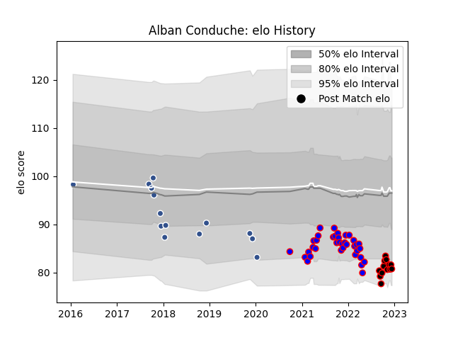

---  
layout: page  
title: Alban Conduche  
date: 2023-01-15 11:43:36.952156  
categories: player  
---
# Alban Conduche

## Positions: C

## Current elo: 88.0

## Current Percentile: 9.0

# Elo History

# Match History

| Team   |   Appearances |   Win Rate |
|:-------|--------------:|-----------:|
| Dijon  |            41 |  0.353659  |
| Nice   |            15 |  0.433333  |
| Agen   |            14 |  0.0714286 |

| Opponent                   |   Matches |   Win Rate |
|:---------------------------|----------:|-----------:|
| Dax                        |         5 |   0.2      |
| Suresnes                   |         5 |   0.4      |
| Albi                       |         4 |   0.125    |
| Blagnac                    |         4 |   0.75     |
| Tarbes                     |         4 |   0.625    |
| Chambery                   |         4 |   0.25     |
| Cognac Saint Jean d'Angély |         4 |   0.25     |
| Narbonne                   |         4 |   0.25     |
| Aubenas                    |         3 |   0.666667 |
| Valence Romans Drome Rugby |         3 |   0.333333 |
| US Bressane                |         3 |   0        |
| Nice                       |         3 |   0.333333 |
| Massy                      |         3 |   0.333333 |
| Bourgoin-Jallieu           |         3 |   0.333333 |
| Gloucester Rugby           |         2 |   0        |
| Pau                        |         2 |   0        |
| Soyaux-Angouleme           |         2 |   0.5      |
| Edinburgh                  |         2 |   0        |
| Zebre                      |         2 |   0.5      |
| Harlequins                 |         1 |   0        |
| Grenoble                   |         1 |   0        |
| Oyonnax                    |         1 |   0        |
| Rennes                     |         1 |   1        |
| Stade Toulousain           |         1 |   0        |
| Carqueiranne-Hyères        |         1 |   1        |
| Bordeaux Begles            |         1 |   0        |
| Wasps                      |         1 |   0        |