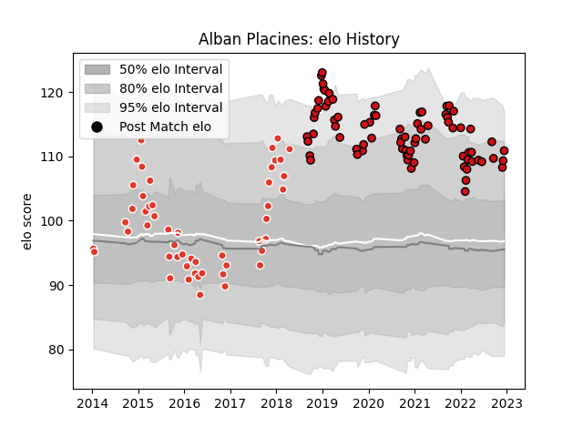

---  
layout: page  
title: Alban Placines  
date: 2022-12-14 11:31:32.128516  
categories: player  
---
# Alban Placines

## Positions: FL

## Current elo: 111.0

## Current Percentile: 87.0

# Elo History

# Match History

| Team               |   Appearances |   Win Rate |
|:-------------------|--------------:|-----------:|
| Stade Toulousain   |            77 |   0.649351 |
| Biarritz Olympique |            50 |   0.48     |

| Opponent             |   Matches |   Win Rate |
|:---------------------|----------:|-----------:|
| Pau                  |         8 |   0.625    |
| Montpellier Herault  |         7 |   0.714286 |
| Perpignan            |         7 |   0.714286 |
| Lyon                 |         6 |   0.166667 |
| Bayonne              |         6 |   0.666667 |
| Bordeaux Begles      |         6 |   1        |
| Clermont Auvergne    |         5 |   0.5      |
| La Rochelle          |         5 |   1        |
| Stade Francais Paris |         5 |   0.4      |
| Castres Olympique    |         5 |   0.1      |
| Mont-de-Marsan       |         4 |   0.25     |
| Racing 92            |         4 |   0.25     |
| Agen                 |         4 |   1        |
| Bourgoin-Jallieu     |         4 |   1        |
| Colomiers            |         3 |   0.333333 |
| Brive                |         3 |   0.666667 |
| Grenoble             |         3 |   0.666667 |
| Tarbes               |         3 |   0.333333 |
| Beziers              |         3 |   0.666667 |
| Toulon               |         3 |   0.666667 |
| Massy                |         3 |   1        |
| Soyaux-Angouleme     |         2 |   0.5      |
| Provence Rugby       |         2 |   0.5      |
| Vannes               |         2 |   0.5      |
| Narbonne             |         2 |   1        |
| Leinster             |         2 |   0.5      |
| Montauban            |         2 |   0.5      |
| Albi                 |         2 |   0        |
| Dax                  |         2 |   0.5      |
| Connacht             |         2 |   1        |
| Aurillac             |         2 |   0        |
| Munster              |         1 |   1        |
| Oyonnax              |         1 |   0        |
| Gloucester Rugby     |         1 |   1        |
| Exeter Chiefs        |         1 |   0        |
| Sale Sharks          |         1 |   0        |
| Carcassonne          |         1 |   0        |
| Biarritz Olympique   |         1 |   1        |
| Bath Rugby           |         1 |   1        |
| Ulster               |         1 |   1        |
| Wasps                |         1 |   0        |