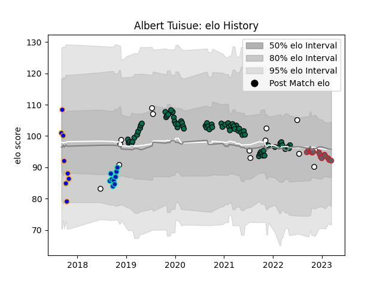

---  
layout: page  
title: Albert Tuisue  
date: 2022-12-18 16:35:29.677899  
categories: player  
---
# Albert Tuisue

## Positions: N8, L

## Country: Fiji

## Current elo: 100.0

## Current Percentile: 71.0

# Elo History

# Match History

| Team                |   Appearances |   Win Rate |
|:--------------------|--------------:|-----------:|
| London Irish        |            63 |   0.468254 |
| Fiji                |            14 |   0.321429 |
| Gloucester Rugby    |             8 |   0.75     |
| Greater Sydney Rams |             8 |   0.375    |
| Fijian Drua         |             7 |   0.857143 |

| Opponent            |   Matches |   Win Rate |
|:--------------------|----------:|-----------:|
| Exeter Chiefs       |         6 |   0.5      |
| Worcester Warriors  |         5 |   0.4      |
| Wasps               |         5 |   0.5      |
| Harlequins          |         5 |   0.5      |
| Bristol Rugby       |         5 |   0.4      |
| Gloucester Rugby    |         5 |   0.5      |
| Sale Sharks         |         5 |   0.2      |
| Leicester Tigers    |         5 |   0.2      |
| Northampton Saints  |         4 |   0.25     |
| Bath Rugby          |         3 |   0.333333 |
| Saracens            |         3 |   0.333333 |
| Newcastle Falcons   |         3 |   0.666667 |
| New Zealand         |         2 |   0        |
| Queensland Country  |         2 |   0        |
| New Zealand Maori   |         2 |   0.5      |
| Scotland            |         2 |   0        |
| Sydney Rays         |         2 |   1        |
| Tonga               |         2 |   0.5      |
| Melbourne Rising    |         2 |   0.5      |
| NSW Country Eagles  |         2 |   1        |
| Brisbane City       |         2 |   1        |
| Canberra Vikings    |         2 |   0.5      |
| Leinster            |         1 |   0        |
| London Irish        |         1 |   1        |
| Western Force       |         1 |   1        |
| Bayonne             |         1 |   1        |
| Wales               |         1 |   0        |
| Uruguay             |         1 |   1        |
| Toulon              |         1 |   0        |
| Bordeaux Begles     |         1 |   1        |
| Spain               |         1 |   1        |
| Scarlets            |         1 |   0        |
| Cornish Pirates     |         1 |   1        |
| Samoa               |         1 |   0        |
| Coventry            |         1 |   1        |
| Richmond            |         1 |   1        |
| Doncaster           |         1 |   1        |
| Perth Spirit        |         1 |   0        |
| Pau                 |         1 |   1        |
| Nottingham          |         1 |   1        |
| Ealing Trailfinders |         1 |   1        |
| Edinburgh           |         1 |   1        |
| Fijian Drua         |         1 |   0        |
| Georgia             |         1 |   0.5      |
| Hartpury College    |         1 |   1        |
| Ireland             |         1 |   0        |
| London Scottish     |         1 |   1        |
| Agen                |         1 |   1        |