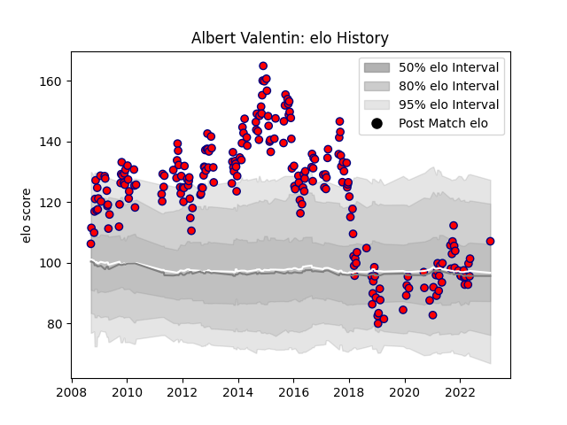

---  
layout: page  
title: Albert Valentin  
date: 2023-03-21 18:19:46.876499  
categories: player  
---
# Albert Valentin

Last updated: 2023-03-21
## Positions: W

## Current elo: 99.0

## Current Percentile: 70.0

# Elo History

# Match History

| Team     |   Appearances |   Win Rate |
|:---------|--------------:|-----------:|
| Aurillac |           235 |   0.551064 |

| Opponent                   |   Matches |   Win Rate |
|:---------------------------|----------:|-----------:|
| Colomiers                  |        16 |   0.5      |
| Beziers                    |        16 |   0.5      |
| Carcassonne                |        13 |   0.538462 |
| Narbonne                   |        13 |   0.807692 |
| Grenoble                   |        12 |   0.458333 |
| Mont-de-Marsan             |        12 |   0.583333 |
| Tarbes                     |        11 |   0.818182 |
| Albi                       |        11 |   0.363636 |
| Agen                       |        10 |   0.4      |
| Perpignan                  |         9 |   0.555556 |
| Montauban                  |         9 |   0.611111 |
| La Rochelle                |         9 |   0.555556 |
| Dax                        |         8 |   0.5      |
| Provence Rugby             |         7 |   0.714286 |
| Pau                        |         7 |   0.285714 |
| Bayonne                    |         7 |   0.142857 |
| Oyonnax                    |         7 |   0.571429 |
| Auch                       |         7 |   0.571429 |
| Vannes                     |         6 |   0.333333 |
| Bourgoin-Jallieu           |         6 |   0.833333 |
| Lyon                       |         5 |   0.4      |
| Biarritz Olympique         |         5 |   0.6      |
| Massy                      |         5 |   0.8      |
| Rouen                      |         4 |   0.5      |
| Soyaux-Angouleme           |         4 |   0.75     |
| Brive                      |         3 |   0.666667 |
| Bordeaux Begles            |         3 |   0.666667 |
| US Bressane                |         3 |   1        |
| Nevers                     |         2 |   0        |
| Lannemezan                 |         2 |   1        |
| Périgueux                  |         2 |   0.5      |
| Valence Romans Drome Rugby |         1 |   0        |