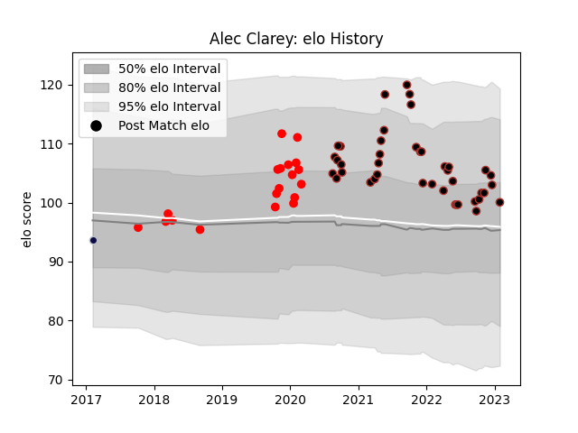

---  
layout: page  
title: Alec Clarey  
date: 2023-01-30 11:42:08.544845  
categories: player  
---
# Alec Clarey

## Positions: P

## Current elo: 100.0

## Current Percentile: 63.0

# Elo History

# Match History

| Team          |   Appearances |   Win Rate |
|:--------------|--------------:|-----------:|
| Saracens      |            42 |   0.690476 |
| Jersey        |            19 |   0.421053 |
| Bristol Rugby |             1 |   0        |

| Opponent            |   Matches |   Win Rate |
|:--------------------|----------:|-----------:|
| Bristol Rugby       |         5 |   0.8      |
| Exeter Chiefs       |         5 |   0.6      |
| Ealing Trailfinders |         4 |   0.25     |
| Newcastle Falcons   |         4 |   0.5      |
| Sale Sharks         |         3 |   0.666667 |
| Coventry            |         3 |   0.666667 |
| Doncaster           |         3 |   0.666667 |
| Gloucester Rugby    |         3 |   0.666667 |
| Ampthill            |         2 |   1        |
| London Scottish     |         2 |   0.5      |
| Worcester Warriors  |         2 |   0.5      |
| Wasps               |         2 |   0        |
| Nottingham          |         2 |   1        |
| Northampton Saints  |         2 |   1        |
| Leicester Tigers    |         2 |   0        |
| Harlequins          |         2 |   1        |
| Edinburgh           |         2 |   0.5      |
| Cornish Pirates     |         2 |   0        |
| Bedford             |         2 |   0.5      |
| Yorkshire Carnegie  |         2 |   0.5      |
| Leinster            |         1 |   1        |
| London Irish        |         1 |   0.5      |
| Bath Rugby          |         1 |   0.5      |
| Lyon                |         1 |   1        |
| Hartpury College    |         1 |   1        |
| Racing 92           |         1 |   0        |
| Richmond            |         1 |   1        |
| Brive               |         1 |   1        |