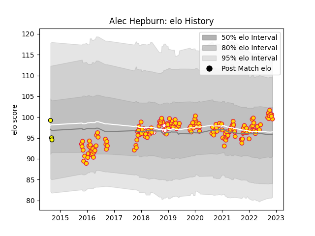

---  
layout: page  
title: Alec Hepburn  
date: 2022-12-14 11:25:11.133637  
categories: player  
---
# Alec Hepburn

## Positions: P

## Country: England

## Current elo: 100.0

## Current Percentile: 65.0

# Elo History

# Match History

| Team          |   Appearances |   Win Rate |
|:--------------|--------------:|-----------:|
| Exeter Chiefs |           160 |   0.675    |
| England       |             7 |   0.857143 |
| Perth Spirit  |             3 |   0.333333 |

| Opponent            |   Matches |   Win Rate |
|:--------------------|----------:|-----------:|
| Sale Sharks         |        14 |   0.714286 |
| Northampton Saints  |        14 |   0.642857 |
| Harlequins          |        14 |   0.785714 |
| Wasps               |        13 |   0.538462 |
| Saracens            |        13 |   0.384615 |
| Bath Rugby          |        13 |   0.846154 |
| Leicester Tigers    |        11 |   0.636364 |
| Newcastle Falcons   |        11 |   0.727273 |
| Gloucester Rugby    |        11 |   0.636364 |
| Worcester Warriors  |        10 |   0.9      |
| Bristol Rugby       |         9 |   0.666667 |
| London Irish        |         7 |   0.857143 |
| Castres Olympique   |         3 |   0.666667 |
| Leinster            |         2 |   0        |
| Montpellier Herault |         2 |   1        |
| Munster             |         2 |   0.25     |
| South Africa        |         2 |   1        |
| Glasgow Warriors    |         2 |   0.75     |
| La Rochelle         |         2 |   1        |
| Ospreys             |         2 |   0.5      |
| Japan               |         1 |   1        |
| Canberra Vikings    |         1 |   1        |
| Bordeaux Begles     |         1 |   0        |
| Wales               |         1 |   1        |
| Stade Toulousain    |         1 |   1        |
| Scarlets            |         1 |   1        |
| Clermont Auvergne   |         1 |   0        |
| Racing 92           |         1 |   1        |
| New Zealand         |         1 |   0        |
| Melbourne Rising    |         1 |   0        |
| Greater Sydney Rams |         1 |   0        |
| Italy               |         1 |   1        |
| Australia           |         1 |   1        |