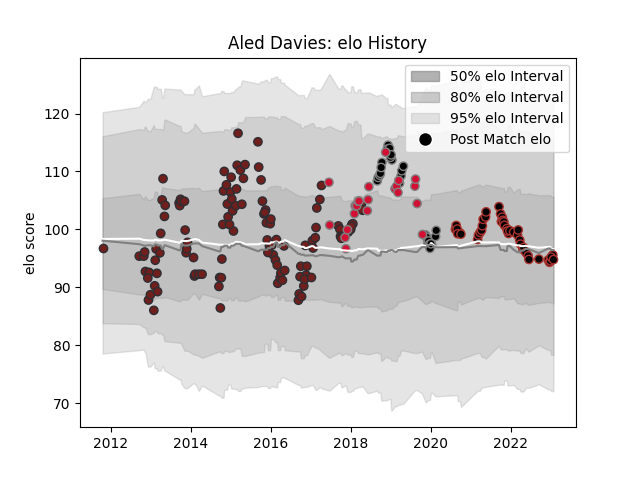

---  
layout: page  
title: Aled Davies  
date: 2022-12-18 16:25:06.755074  
categories: player  
---
# Aled Davies

## Positions: SH

## Country: Wales

## Current elo: 103.0

## Current Percentile: 75.0

# Elo History

# Match History

| Team     |   Appearances |   Win Rate |
|:---------|--------------:|-----------:|
| Scarlets |           120 |   0.604167 |
| Saracens |            37 |   0.756757 |
| Ospreys  |            26 |   0.538462 |
| Wales    |            22 |   0.772727 |

| Opponent             |   Matches |   Win Rate |
|:---------------------|----------:|-----------:|
| Dragons              |        13 |   0.692308 |
| Edinburgh            |        13 |   0.653846 |
| Ulster               |        12 |   0.5      |
| Zebre                |        11 |   1        |
| Benetton Treviso     |        11 |   0.909091 |
| Cardiff Blues        |        10 |   0.6      |
| Leinster             |        10 |   0.4      |
| Glasgow Warriors     |        10 |   0.6      |
| Connacht             |         8 |   0.875    |
| Ospreys              |         7 |   0.571429 |
| Munster              |         7 |   0.357143 |
| Leicester Tigers     |         7 |   0.571429 |
| Exeter Chiefs        |         4 |   0.25     |
| Saracens             |         4 |   0.125    |
| Racing 92            |         4 |   0        |
| Harlequins           |         4 |   1        |
| Sale Sharks          |         4 |   0.5      |
| England              |         4 |   0.5      |
| Worcester Warriors   |         4 |   0.5      |
| Toulon               |         4 |   0.25     |
| Bath Rugby           |         4 |   0.875    |
| Scarlets             |         3 |   0.333333 |
| Northampton Saints   |         3 |   0.333333 |
| Bristol Rugby        |         3 |   0.666667 |
| London Irish         |         3 |   0.5      |
| Wasps                |         3 |   0.333333 |
| Ireland              |         3 |   0.333333 |
| Argentina            |         2 |   1        |
| Italy                |         2 |   1        |
| Cheetahs             |         2 |   1        |
| South Africa         |         2 |   1        |
| Newcastle Falcons    |         2 |   1        |
| Tonga                |         2 |   1        |
| Scotland             |         2 |   1        |
| Uruguay              |         1 |   1        |
| Stade Francais Paris |         1 |   1        |
| Samoa                |         1 |   1        |
| Southern Kings       |         1 |   1        |
| Ampthill             |         1 |   1        |
| Richmond             |         1 |   1        |
| Pau                  |         1 |   1        |
| Jersey               |         1 |   1        |
| Gloucester Rugby     |         1 |   1        |
| Georgia              |         1 |   1        |
| France               |         1 |   1        |
| Ealing Trailfinders  |         1 |   1        |
| Doncaster            |         1 |   1        |
| Coventry             |         1 |   1        |
| Cornish Pirates      |         1 |   0        |
| Bedford              |         1 |   1        |
| Australia            |         1 |   0        |
| La Rochelle          |         1 |   1        |