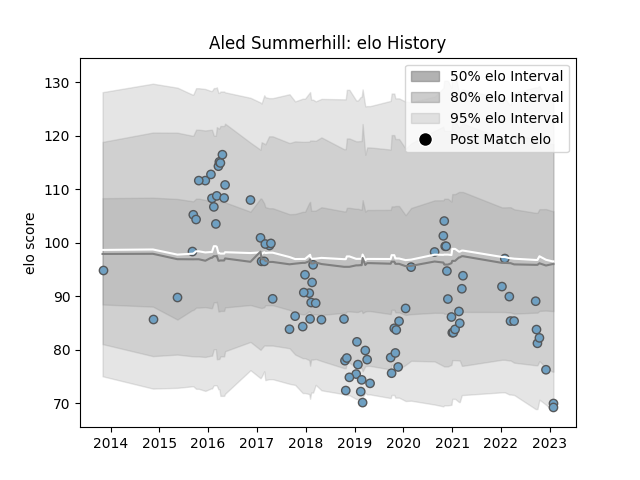

---  
layout: page  
title: Aled Summerhill  
date: 2022-12-12 15:39:01.563226  
categories: player  
---
# Aled Summerhill

## Positions: W

## Current elo: 80.0

## Current Percentile: 9.0

# Elo History

# Match History

| Team          |   Appearances |   Win Rate |
|:--------------|--------------:|-----------:|
| Cardiff Blues |            87 |   0.494253 |

| Opponent            |   Matches |   Win Rate |
|:--------------------|----------:|-----------:|
| Edinburgh           |        10 |   0.5      |
| Munster             |         8 |   0.375    |
| Benetton Treviso    |         7 |   0.857143 |
| Glasgow Warriors    |         7 |   0        |
| Scarlets            |         7 |   0.714286 |
| Ulster              |         5 |   0.2      |
| Ospreys             |         5 |   0.2      |
| Zebre               |         5 |   1        |
| Dragons             |         4 |   1        |
| Leinster            |         3 |   0.333333 |
| Lyon                |         3 |   1        |
| Connacht            |         3 |   0.333333 |
| Sale Sharks         |         3 |   0.333333 |
| Cheetahs            |         3 |   0.666667 |
| Leicester Tigers    |         2 |   0        |
| Southern Kings      |         2 |   1        |
| Calvisano           |         2 |   1        |
| Lions               |         2 |   0        |
| Exeter Chiefs       |         1 |   0        |
| Gloucester Rugby    |         1 |   0        |
| Bulls               |         1 |   0        |
| London Irish        |         1 |   0        |
| Montpellier Herault |         1 |   1        |
| Worcester Warriors  |         1 |   0        |