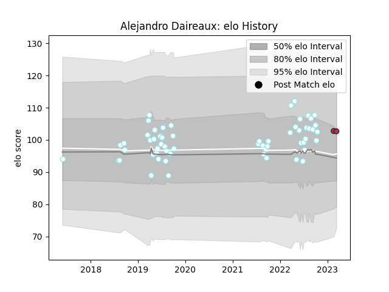

---  
layout: page  
title: Alejandro Daireaux  
date: 2023-03-16 11:29:48.206885  
categories: player  
---
# Alejandro Daireaux

## Positions: FL, N8

## Current elo: 103.0

## Current Percentile: 72.0

# Elo History

# Match History

| Team         |   Appearances |   Win Rate |
|:-------------|--------------:|-----------:|
| SIC          |            58 |   0.741379 |
| Old Glory DC |             2 |   0.5      |

| Opponent               |   Matches |   Win Rate |
|:-----------------------|----------:|-----------:|
| Pucara                 |         7 |   0.857143 |
| Belgrano               |         6 |   0.666667 |
| CUBA                   |         6 |   1        |
| Alumni                 |         5 |   1        |
| Newman                 |         5 |   0.4      |
| CASI                   |         5 |   0.4      |
| San Luis               |         4 |   0.75     |
| Hindu                  |         4 |   0.25     |
| Atlético del Rosario   |         4 |   0.75     |
| Regatas Bella Vista    |         3 |   1        |
| La Plata               |         3 |   0.666667 |
| Buenos Aires           |         3 |   1        |
| New England Free Jacks |         1 |   0        |
| Los Tilos              |         1 |   1        |
| Lomas                  |         1 |   1        |
| Chicago Hounds         |         1 |   1        |
| San Martin             |         1 |   1        |