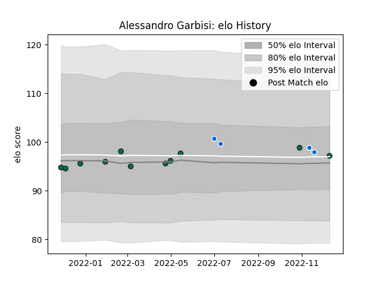

---  
layout: page  
title: Alessandro Garbisi  
date: 2023-03-21 18:12:26.840388  
categories: player  
---
# Alessandro Garbisi

Last updated: 2023-03-21
## Positions: SH

## Country: Italy

## Current elo: 80.0

## Current Percentile: 12.0

# Elo History

# Match History

| Team                |   Appearances |   Win Rate |
|:--------------------|--------------:|-----------:|
| Benetton Treviso    |            12 |   0.375    |
| Mogliano Rugby 1969 |            11 |   0.363636 |
| Italy               |             3 |   0.333333 |

| Opponent               |   Matches |   Win Rate |
|:-----------------------|----------:|-----------:|
| Glasgow Warriors       |         3 |   0.333333 |
| Zebre                  |         2 |   1        |
| Conad Valorugby Emilia |         2 |   0        |
| Fiamme Oro Roma        |         2 |   0.5      |
| Petrarca Padova Rugby  |         1 |   0        |
| Stade Francais Paris   |         1 |   0        |
| South Africa           |         1 |   0        |
| Rugby Viadana 1970     |         1 |   0        |
| Rugby Lyons Piacenza   |         1 |   1        |
| Rugby Colorno 1975     |         1 |   1        |
| Rugby Calvisano        |         1 |   0        |
| Romania                |         1 |   1        |
| Bayonne                |         1 |   1        |
| Lions                  |         1 |   0        |
| Bulls                  |         1 |   0        |
| Lazio Rugby            |         1 |   1        |
| Georgia                |         1 |   0        |
| Femi CZ Rugby Rovigo   |         1 |   0        |
| Edinburgh              |         1 |   0        |
| Dragons                |         1 |   0.5      |
| Leinster               |         1 |   0        |