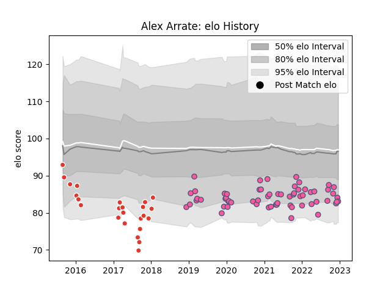

---  
layout: page  
title: Alex Arrate  
date: 2023-02-02 18:41:40.639509  
categories: player  
---
# Alex Arrate

## Positions: C

## Current elo: 70.0

## Current Percentile: 7.0

# Elo History

# Match History

| Team                 |   Appearances |   Win Rate |
|:---------------------|--------------:|-----------:|
| Stade Francais Paris |            67 |   0.432836 |
| Biarritz Olympique   |            35 |   0.542857 |

| Opponent            |   Matches |   Win Rate |
|:--------------------|----------:|-----------:|
| Perpignan           |         7 |   0.571429 |
| Castres Olympique   |         7 |   0.571429 |
| La Rochelle         |         7 |   0.714286 |
| Clermont Auvergne   |         6 |   0.333333 |
| Montpellier Herault |         5 |   0.3      |
| Bordeaux Begles     |         5 |   0.2      |
| Racing 92           |         4 |   0.25     |
| Bayonne             |         4 |   0.5      |
| Stade Toulousain    |         4 |   0.625    |
| Brive               |         4 |   0.25     |
| Beziers             |         3 |   1        |
| Montauban           |         3 |   0.333333 |
| Bristol Rugby       |         3 |   0        |
| Carcassonne         |         3 |   0.666667 |
| Colomiers           |         3 |   0.666667 |
| Pau                 |         3 |   1        |
| Toulon              |         3 |   0.333333 |
| Albi                |         2 |   0.5      |
| Lyon                |         2 |   0.5      |
| Lions               |         2 |   0.5      |
| Grenoble            |         2 |   0.5      |
| Bourgoin-Jallieu    |         2 |   0.5      |
| Benetton Treviso    |         2 |   0.5      |
| Tarbes              |         1 |   0        |
| Worcester Warriors  |         1 |   0        |
| Soyaux-Angouleme    |         1 |   0        |
| Provence Rugby      |         1 |   0        |
| Vannes              |         1 |   0        |
| Agen                |         1 |   1        |
| Oyonnax             |         1 |   1        |
| Ospreys             |         1 |   0        |
| Nevers              |         1 |   1        |
| Narbonne            |         1 |   0        |
| Mont-de-Marsan      |         1 |   1        |
| Massy               |         1 |   1        |
| Dax                 |         1 |   1        |
| Connacht            |         1 |   0        |
| Biarritz Olympique  |         1 |   0        |
| Zebre               |         1 |   0        |