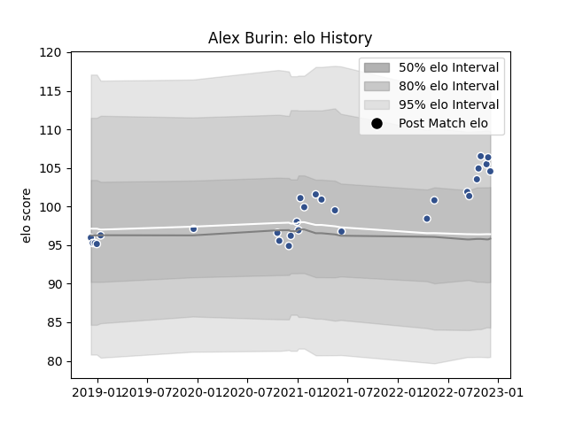

---  
layout: page  
title: Alex Burin  
date: 2023-03-21 18:13:05.640579  
categories: player  
---
# Alex Burin

Last updated: 2023-03-21
## Positions: P

## Current elo: 97.0

## Current Percentile: 72.0

# Elo History

# Match History

| Team   |   Appearances |   Win Rate |
|:-------|--------------:|-----------:|
| Agen   |            35 |   0.142857 |

| Opponent             |   Matches |   Win Rate |
|:---------------------|----------:|-----------:|
| Lyon                 |         2 |        0   |
| Colomiers            |         2 |        0   |
| Stade Toulousain     |         2 |        0   |
| Stade Francais Paris |         2 |        0   |
| Oyonnax              |         2 |        0   |
| Montauban            |         2 |        0   |
| La Rochelle          |         2 |        0   |
| Grenoble             |         2 |        0.5 |
| Vannes               |         2 |        0.5 |
| Brive                |         2 |        0   |
| Beziers              |         2 |        0   |
| Castres Olympique    |         1 |        0   |
| Carcassonne          |         1 |        0   |
| London Irish         |         1 |        0   |
| Benetton Treviso     |         1 |        0   |
| Massy                |         1 |        1   |
| Mont-de-Marsan       |         1 |        1   |
| Montpellier Herault  |         1 |        0   |
| Nevers               |         1 |        0   |
| Bordeaux Begles      |         1 |        0   |
| Racing 92            |         1 |        0   |
| Rouen                |         1 |        0   |
| Biarritz Olympique   |         1 |        1   |
| Bayonne              |         1 |        0   |