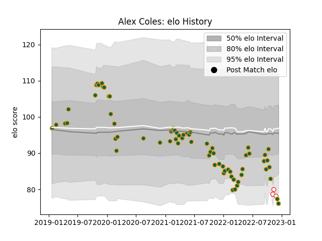

---  
layout: page  
title: Alex Coles  
date: 2022-11-15 23:38:53.188870  
categories: player  
---
# Alex Coles

## Positions: L, FL

## Country: England

## Current elo: 79.0

## Current Percentile: 6.0

# Elo History

# Match History

| Team               |   Appearances |   Win Rate |
|:-------------------|--------------:|-----------:|
| Northampton Saints |            65 |   0.538462 |
| England            |             2 |   0.5      |

| Opponent           |   Matches |   Win Rate |
|:-------------------|----------:|-----------:|
| Harlequins         |         7 |   0.428571 |
| Worcester Warriors |         6 |   1        |
| Wasps              |         6 |   0.666667 |
| Leicester Tigers   |         6 |   0.333333 |
| Bath Rugby         |         6 |   0.333333 |
| Newcastle Falcons  |         5 |   0.8      |
| London Irish       |         5 |   0.8      |
| Sale Sharks        |         5 |   0.4      |
| Exeter Chiefs      |         4 |   0.25     |
| Saracens           |         4 |   0.25     |
| Bristol Rugby      |         3 |   0.333333 |
| Gloucester Rugby   |         3 |   0.666667 |
| Leinster           |         2 |   0        |
| Lyon               |         1 |   1        |
| Japan              |         1 |   1        |
| Timisoara Saracens |         1 |   1        |
| Benetton Treviso   |         1 |   1        |
| Argentina          |         1 |   0        |