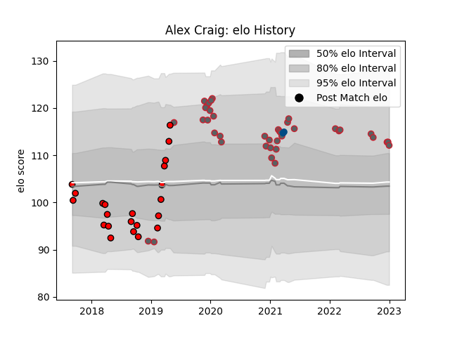

---  
layout: page  
title: Alex Craig  
date: 2022-12-31 16:28:57.968556  
categories: player  
---
# Alex Craig

## Positions: L

## Country: Scotland

## Current elo: 100.0

## Current Percentile: 70.0

# Elo History

# Match History

| Team             |   Appearances |   Win Rate |
|:-----------------|--------------:|-----------:|
| Gloucester Rugby |            39 |   0.333333 |
| Hartpury College |            22 |   0.340909 |
| Scotland         |             2 |   1        |

| Opponent            |   Matches |   Win Rate |
|:--------------------|----------:|-----------:|
| Bristol Rugby       |         4 |   0        |
| Wasps               |         4 |   0.75     |
| Sale Sharks         |         4 |   0        |
| London Irish        |         4 |   0.75     |
| Leicester Tigers    |         3 |   0        |
| Ealing Trailfinders |         3 |   0        |
| Northampton Saints  |         3 |   0.333333 |
| Yorkshire Carnegie  |         3 |   0.5      |
| Montpellier Herault |         2 |   0.5      |
| Exeter Chiefs       |         2 |   0        |
| Worcester Warriors  |         2 |   1        |
| Stade Toulousain    |         2 |   0        |
| Connacht            |         2 |   0.5      |
| Richmond            |         2 |   0.5      |
| Nottingham          |         2 |   0.5      |
| Cornish Pirates     |         2 |   0        |
| Newcastle Falcons   |         2 |   0.5      |
| Bath Rugby          |         2 |   0.5      |
| London Scottish     |         2 |   1        |
| Bedford             |         2 |   0.5      |
| Jersey              |         2 |   0.5      |
| Harlequins          |         2 |   0        |
| Coventry            |         1 |   0        |
| Leinster            |         1 |   0        |
| Italy               |         1 |   1        |
| Saracens            |         1 |   0        |
| Castres Olympique   |         1 |   0        |
| France              |         1 |   1        |
| Doncaster           |         1 |   0        |