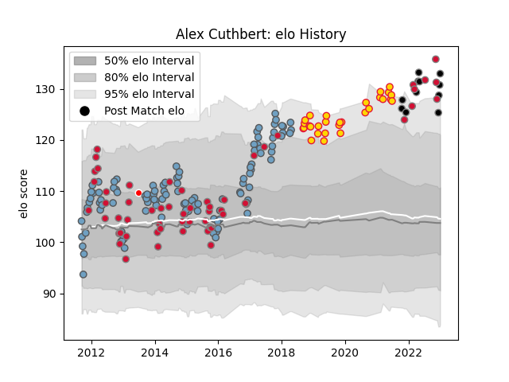

---  
layout: page  
title: Alex Cuthbert  
date: 2022-11-16 11:39:02.325920  
categories: player  
---
# Alex Cuthbert

## Positions: W

## Country: Wales

## Current elo: 122.0

## Current Percentile: 94.0

# Elo History

# Match History

| Team                    |   Appearances |   Win Rate |
|:------------------------|--------------:|-----------:|
| Cardiff Blues           |           114 |   0.508772 |
| Wales                   |            53 |   0.537736 |
| Exeter Chiefs           |            29 |   0.724138 |
| Ospreys                 |             7 |   0.857143 |
| British and Irish Lions |             1 |   1        |

| Opponent            |   Matches |   Win Rate |
|:--------------------|----------:|-----------:|
| Dragons             |        12 |   0.75     |
| Scarlets            |        12 |   0.333333 |
| Glasgow Warriors    |        10 |   0.3      |
| Australia           |         9 |   0.111111 |
| Leinster            |         8 |   0        |
| Connacht            |         8 |   0.8125   |
| England             |         8 |   0.375    |
| Edinburgh           |         7 |   0.714286 |
| Ulster              |         7 |   0.357143 |
| Ospreys             |         7 |   0.142857 |
| Sale Sharks         |         7 |   0.857143 |
| London Irish        |         6 |   0.833333 |
| Ireland             |         6 |   0.416667 |
| Scotland            |         5 |   1        |
| France              |         5 |   0.8      |
| South Africa        |         5 |   0.4      |
| Harlequins          |         5 |   0.2      |
| Newcastle Falcons   |         4 |   1        |
| Montpellier Herault |         4 |   0.25     |
| Toulon              |         4 |   0.25     |
| Italy               |         4 |   1        |
| Zebre               |         4 |   0.75     |
| Bristol Rugby       |         4 |   0.75     |
| Benetton Treviso    |         4 |   1        |
| Pau                 |         3 |   1        |
| Worcester Warriors  |         3 |   1        |
| Gloucester Rugby    |         3 |   0.333333 |
| Munster             |         3 |   0.666667 |
| Fiji                |         3 |   1        |
| Exeter Chiefs       |         2 |   0        |
| Calvisano           |         2 |   1        |
| Saracens            |         2 |   0        |
| Bath Rugby          |         2 |   0.5      |
| Racing 92           |         2 |   1        |
| Stade Toulousain    |         2 |   1        |
| Northampton Saints  |         2 |   1        |
| New Zealand         |         2 |   0        |
| Wasps               |         2 |   0.5      |
| Lyon                |         2 |   1        |
| Argentina           |         2 |   0.5      |
| Stormers            |         1 |   0        |
| Uruguay             |         1 |   1        |
| Tonga               |         1 |   1        |
| Grenoble            |         1 |   1        |
| Samoa               |         1 |   0        |
| Southern Kings      |         1 |   1        |
| Cardiff Blues       |         1 |   1        |
| Japan               |         1 |   1        |
| Cheetahs            |         1 |   0        |
| Georgia             |         1 |   1        |
| La Rochelle         |         1 |   1        |
| Aironi              |         1 |   1        |