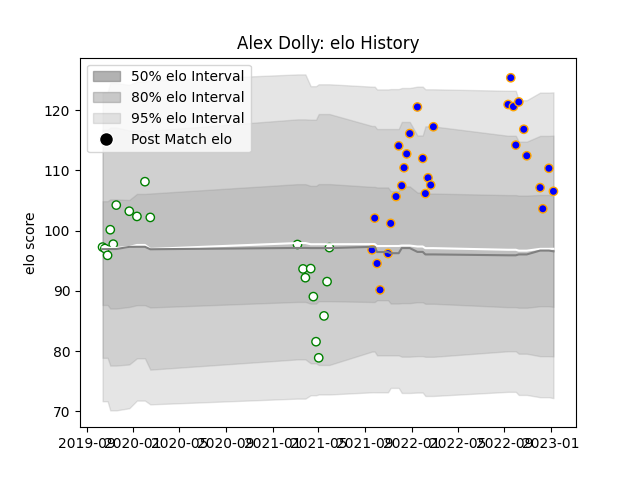

---  
layout: page  
title: Alex Dolly  
date: 2022-12-14 11:21:56.672692  
categories: player  
---
# Alex Dolly

## Positions: SH

## Current elo: 108.0

## Current Percentile: 90.0

# Elo History

# Match History

| Team       |   Appearances |   Win Rate |
|:-----------|--------------:|-----------:|
| Doncaster  |            25 |   0.76     |
| Nottingham |            12 |   0.333333 |

| Opponent            |   Matches |   Win Rate |
|:--------------------|----------:|-----------:|
| Bedford             |         5 |       0.8  |
| Jersey              |         5 |       0.4  |
| Ampthill            |         4 |       0.75 |
| Ealing Trailfinders |         4 |       0.5  |
| Richmond            |         4 |       1    |
| Cornish Pirates     |         3 |       0    |
| London Scottish     |         3 |       1    |
| Coventry            |         2 |       0.5  |
| Hartpury College    |         2 |       1    |
| Nottingham          |         2 |       0.5  |
| Doncaster           |         1 |       0    |
| Saracens            |         1 |       0    |
| Yorkshire Carnegie  |         1 |       1    |