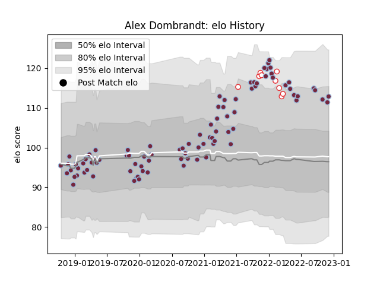

---  
layout: page  
title: Alex Dombrandt  
date: 2023-03-17 17:21:21.847584  
categories: player  
---
# Alex Dombrandt

## Positions: N8

## Country: England

## Current elo: 129.0

## Current Percentile: 98.0

# Elo History

# Match History

| Team       |   Appearances |   Win Rate |
|:-----------|--------------:|-----------:|
| Harlequins |           101 |   0.574257 |
| England    |            13 |   0.615385 |

| Opponent            |   Matches |   Win Rate |
|:--------------------|----------:|-----------:|
| Exeter Chiefs       |         9 |   0.444444 |
| Gloucester Rugby    |         8 |   0.875    |
| Bath Rugby          |         8 |   0.75     |
| Bristol Rugby       |         8 |   0.5      |
| Northampton Saints  |         8 |   0.5      |
| Leicester Tigers    |         8 |   0.5625   |
| Wasps               |         6 |   0.666667 |
| Newcastle Falcons   |         6 |   0.833333 |
| London Irish        |         5 |   0.7      |
| Saracens            |         5 |   0.2      |
| Sale Sharks         |         5 |   0.4      |
| Worcester Warriors  |         5 |   0.6      |
| Racing 92           |         3 |   0.333333 |
| Cardiff Blues       |         2 |   1        |
| Castres Olympique   |         2 |   1        |
| Wales               |         2 |   1        |
| Ulster              |         2 |   0        |
| Sharks              |         2 |   0.5      |
| Scotland            |         2 |   0        |
| Agen                |         2 |   1        |
| Clermont Auvergne   |         2 |   0        |
| Montpellier Herault |         2 |   0.5      |
| France              |         2 |   0        |
| Italy               |         2 |   1        |
| Munster             |         1 |   0        |
| Ireland             |         1 |   0        |
| Canada              |         1 |   1        |
| Australia           |         1 |   1        |
| South Africa        |         1 |   1        |
| Tonga               |         1 |   1        |
| Benetton Treviso    |         1 |   0        |
| Grenoble            |         1 |   1        |