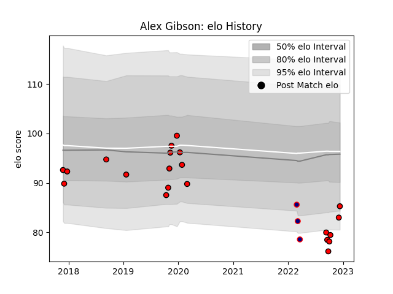

---  
layout: page  
title: Alex Gibson  
date: 2022-12-18 16:37:47.311677  
categories: player  
---
# Alex Gibson

## Positions: P, H

## Current elo: 85.0

## Current Percentile: 8.0

# Elo History

# Match History

| Team             |   Appearances |   Win Rate |
|:-----------------|--------------:|-----------:|
| Hartpury College |            21 |   0.380952 |
| London Scottish  |             3 |   0        |

| Opponent            |   Matches |   Win Rate |
|:--------------------|----------:|-----------:|
| Doncaster           |         4 |   0        |
| Ampthill            |         3 |   0.333333 |
| Coventry            |         3 |   0.666667 |
| Ealing Trailfinders |         3 |   0        |
| Bedford             |         2 |   0        |
| Jersey              |         2 |   0        |
| Nottingham          |         2 |   1        |
| Caldy               |         1 |   1        |
| Cornish Pirates     |         1 |   0        |
| London Scottish     |         1 |   1        |
| Richmond            |         1 |   0        |
| Yorkshire Carnegie  |         1 |   1        |