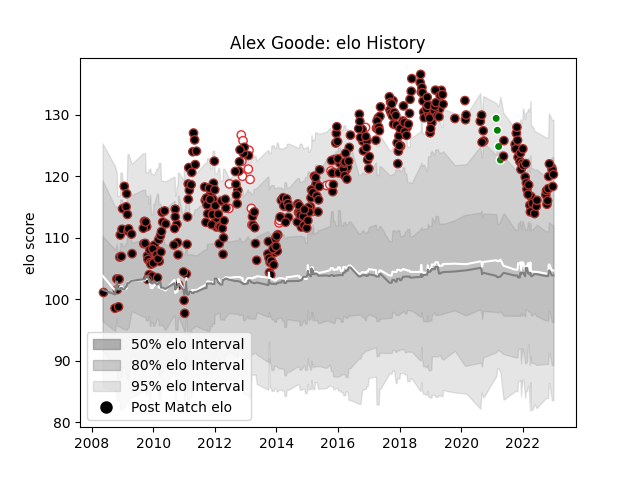

---  
layout: page  
title: Alex Goode  
date: 2022-11-16 11:42:56.711709  
categories: player  
---
# Alex Goode

## Positions: FB, FH

## Country: England

## Current elo: 123.0

## Current Percentile: 93.0

# Elo History

# Match History

| Team                  |   Appearances |   Win Rate |
|:----------------------|--------------:|-----------:|
| Saracens              |           330 |   0.725758 |
| England               |            22 |   0.704545 |
| Green Rockets Tokatsu |             4 |   0        |

| Opponent              |   Matches |   Win Rate |
|:----------------------|----------:|-----------:|
| Northampton Saints    |        32 |   0.65625  |
| Sale Sharks           |        26 |   0.884615 |
| Exeter Chiefs         |        24 |   0.604167 |
| Wasps                 |        24 |   0.708333 |
| Leicester Tigers      |        24 |   0.583333 |
| Harlequins            |        24 |   0.791667 |
| Bath Rugby            |        23 |   0.73913  |
| Gloucester Rugby      |        20 |   0.575    |
| London Irish          |        17 |   0.735294 |
| Newcastle Falcons     |        17 |   0.941176 |
| Worcester Warriors    |        14 |   0.892857 |
| Clermont Auvergne     |         9 |   0.333333 |
| Bristol Rugby         |         8 |   0.75     |
| Munster               |         6 |   0.666667 |
| Toulon                |         5 |   0.4      |
| Racing 92             |         4 |   0.75     |
| Leinster              |         4 |   0.5      |
| Glasgow Warriors      |         4 |   1        |
| Stade Toulousain      |         4 |   0.5      |
| Yorkshire Carnegie    |         4 |   0.75     |
| Ireland               |         4 |   0.75     |
| Ospreys               |         4 |   0.875    |
| Leeds                 |         4 |   0.75     |
| Wales                 |         3 |   0.333333 |
| Scotland              |         3 |   1        |
| Cardiff Blues         |         3 |   1        |
| Ulster                |         3 |   1        |
| Scarlets              |         3 |   0.666667 |
| France                |         3 |   0.666667 |
| South Africa          |         2 |   0.25     |
| Oyonnax               |         2 |   1        |
| Zebre                 |         2 |   1        |
| Lyon                  |         2 |   1        |
| Italy                 |         2 |   1        |
| Benetton Treviso      |         2 |   1        |
| Fiji                  |         2 |   1        |
| Biarritz Olympique    |         2 |   0.5      |
| Edinburgh             |         2 |   0.5      |
| Connacht              |         2 |   1        |
| New Zealand           |         1 |   1        |
| Uruguay               |         1 |   1        |
| Bayonne               |         1 |   1        |
| Yokohama Canon Eagles |         1 |   0        |
| Brive                 |         1 |   1        |
| Coventry              |         1 |   1        |
| Castres Olympique     |         1 |   1        |
| Mont-de-Marsan        |         1 |   1        |
| Shizuoka Blue Revs    |         1 |   0        |
| Hino Red Dolphins     |         1 |   0        |
| Kobelco Kobe Steelers |         1 |   0        |
| London Welsh          |         1 |   1        |
| Australia             |         1 |   0        |