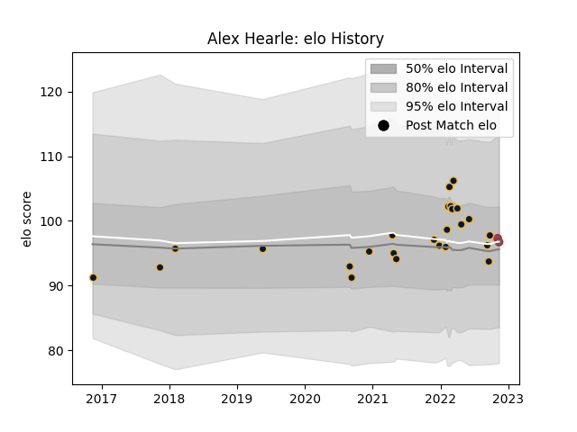

---  
layout: page  
title: Alex Hearle  
date: 2022-11-22 11:34:22.709613  
categories: player  
---
# Alex Hearle

## Positions: W, C

## Current elo: 97.0

## Current Percentile: 58.0

# Elo History

# Match History

| Team               |   Appearances |   Win Rate |
|:-------------------|--------------:|-----------:|
| Worcester Warriors |            25 |       0.22 |
| Gloucester Rugby   |             2 |       0    |

| Opponent           |   Matches |   Win Rate |
|:-------------------|----------:|-----------:|
| Exeter Chiefs      |         4 |      0.25  |
| Newcastle Falcons  |         4 |      0.375 |
| Harlequins         |         3 |      0     |
| Sale Sharks        |         3 |      0     |
| Bath Rugby         |         2 |      0.5   |
| London Irish       |         2 |      0     |
| Saracens           |         2 |      0.5   |
| Wasps              |         2 |      0     |
| Bristol Rugby      |         1 |      1     |
| Dragons            |         1 |      0     |
| Leicester Tigers   |         1 |      0     |
| Northampton Saints |         1 |      0     |
| Pau                |         1 |      0     |