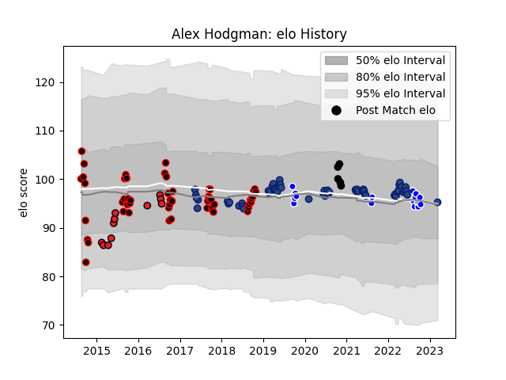

---  
layout: page  
title: Alex Hodgman  
date: 2023-03-12 11:33:24.477094  
categories: player  
---
# Alex Hodgman

## Positions: P

## Country: New Zealand

## Current elo: 95.0

## Current Percentile: 51.0

# Elo History

# Match History

| Team        |   Appearances |   Win Rate |
|:------------|--------------:|-----------:|
| Blues       |            55 |   0.581818 |
| Canterbury  |            53 |   0.792453 |
| Auckland    |            18 |   0.555556 |
| Crusaders   |            11 |   0.545455 |
| New Zealand |             5 |   0.6      |

| Opponent                 |   Matches |   Win Rate |
|:-------------------------|----------:|-----------:|
| Chiefs                   |        11 |   0.5      |
| Tasman                   |        11 |   0.545455 |
| Highlanders              |        10 |   0.6      |
| Taranaki                 |         8 |   0.75     |
| North Harbour            |         8 |   0.875    |
| Hurricanes               |         7 |   0.428571 |
| Crusaders                |         7 |   0.142857 |
| Auckland                 |         7 |   0.714286 |
| Otago                    |         6 |   1        |
| Counties Manukau         |         6 |   0.833333 |
| Queensland Reds          |         6 |   0.833333 |
| Brumbies                 |         5 |   0.8      |
| Wellington               |         5 |   0.4      |
| Southland                |         5 |   0.8      |
| Waikato                  |         4 |   1        |
| Australia                |         4 |   0.75     |
| Melbourne Rebels         |         3 |   0.333333 |
| Hawke's Bay              |         3 |   1        |
| Lions                    |         2 |   0.5      |
| Stormers                 |         2 |   0.5      |
| Northland                |         2 |   0.5      |
| Western Force            |         2 |   1        |
| New South Wales Waratahs |         2 |   1        |
| Moana Pasifika           |         2 |   1        |
| Manawatu                 |         2 |   0.5      |
| Canterbury               |         2 |   0.5      |
| Bay of Plenty            |         2 |   0.5      |
| Jaguares                 |         1 |   0        |
| Sharks                   |         1 |   0        |
| Southern Kings           |         1 |   1        |
| Cheetahs                 |         1 |   1        |
| Bulls                    |         1 |   0.5      |
| British and Irish Lions  |         1 |   1        |
| Blues                    |         1 |   1        |
| Argentina                |         1 |   0        |