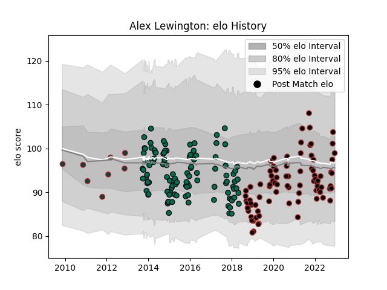

---  
layout: page  
title: Alex Lewington  
date: 2023-02-02 18:59:25.297256  
categories: player  
---
# Alex Lewington

## Positions: W

## Current elo: 87.0

## Current Percentile: 30.0

# Elo History

# Match History

| Team             |   Appearances |   Win Rate |
|:-----------------|--------------:|-----------:|
| London Irish     |           106 |   0.363208 |
| Saracens         |            95 |   0.768421 |
| Leicester Tigers |             8 |   0.375    |

| Opponent             |   Matches |   Win Rate |
|:---------------------|----------:|-----------:|
| Wasps                |        16 |   0.34375  |
| Bath Rugby           |        15 |   0.366667 |
| Newcastle Falcons    |        14 |   0.642857 |
| Harlequins           |        14 |   0.642857 |
| Exeter Chiefs        |        14 |   0.357143 |
| Northampton Saints   |        13 |   0.384615 |
| Leicester Tigers     |        13 |   0.538462 |
| Gloucester Rugby     |        13 |   0.307692 |
| Sale Sharks          |        11 |   0.636364 |
| Saracens             |         8 |   0.125    |
| London Irish         |         7 |   0.642857 |
| Worcester Warriors   |         7 |   0.714286 |
| Bristol Rugby        |         7 |   0.714286 |
| Edinburgh            |         6 |   0.333333 |
| Cardiff Blues        |         5 |   0.8      |
| Grenoble             |         4 |   0.5      |
| Lyon                 |         4 |   1        |
| Ospreys              |         3 |   0.666667 |
| Lusitanos XV         |         2 |   1        |
| Racing 92            |         2 |   0.5      |
| Stade Francais Paris |         2 |   0.5      |
| Munster              |         2 |   0.5      |
| Agen                 |         2 |   1        |
| London Welsh         |         2 |   1        |
| Doncaster            |         2 |   1        |
| Cavalieri Prato      |         2 |   1        |
| Cornish Pirates      |         2 |   0.5      |
| Yorkshire Carnegie   |         2 |   0.5      |
| Glasgow Warriors     |         2 |   1        |
| Jersey               |         2 |   0.5      |
| Nottingham           |         1 |   1        |
| Ealing Trailfinders  |         1 |   1        |
| Richmond             |         1 |   1        |
| London Scottish      |         1 |   1        |
| Rovigo               |         1 |   1        |
| Coventry             |         1 |   1        |
| Scarlets             |         1 |   0        |
| Leinster             |         1 |   1        |
| Brive                |         1 |   1        |
| Bedford              |         1 |   1        |
| Rotherham Titans     |         1 |   1        |