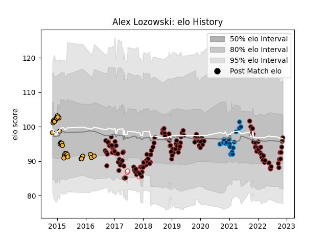

---  
layout: page  
title: Alex Lozowski  
date: 2022-11-15 23:43:16.976604  
categories: player  
---
# Alex Lozowski

## Positions: C, FH

## Country: England

## Current elo: 97.0

## Current Percentile: 50.0

# Elo History

# Match History

| Team                |   Appearances |   Win Rate |
|:--------------------|--------------:|-----------:|
| Saracens            |           139 |   0.741007 |
| Wasps               |            32 |   0.609375 |
| Montpellier Herault |            20 |   0.45     |
| England             |             5 |   1        |

| Opponent             |   Matches |   Win Rate |
|:---------------------|----------:|-----------:|
| Leicester Tigers     |        16 |   0.5625   |
| Northampton Saints   |        14 |   0.785714 |
| Gloucester Rugby     |        14 |   0.642857 |
| Harlequins           |        14 |   0.785714 |
| Sale Sharks          |        13 |   0.846154 |
| Exeter Chiefs        |        13 |   0.423077 |
| Bath Rugby           |        10 |   0.6      |
| Wasps                |         9 |   0.777778 |
| Newcastle Falcons    |         9 |   0.944444 |
| Worcester Warriors   |         8 |   0.875    |
| Bristol Rugby        |         7 |   0.857143 |
| London Irish         |         7 |   0.714286 |
| Toulon               |         6 |   0.666667 |
| Ospreys              |         4 |   0.875    |
| Munster              |         4 |   0.75     |
| Leinster             |         4 |   0.625    |
| Glasgow Warriors     |         4 |   1        |
| Clermont Auvergne    |         4 |   0.5      |
| Castres Olympique    |         4 |   0.5      |
| Racing 92            |         3 |   0.333333 |
| Argentina            |         3 |   1        |
| Cardiff Blues        |         3 |   0.666667 |
| La Rochelle          |         2 |   0.5      |
| Bayonne              |         2 |   0.5      |
| Stade Toulousain     |         2 |   0.5      |
| Scarlets             |         2 |   0.75     |
| Brive                |         2 |   0.5      |
| Agen                 |         2 |   1        |
| Lyon                 |         2 |   0.5      |
| London Welsh         |         2 |   1        |
| Japan                |         1 |   1        |
| Samoa                |         1 |   1        |
| Saracens             |         1 |   0        |
| Edinburgh            |         1 |   0        |
| Stade Francais Paris |         1 |   1        |
| Bordeaux Begles      |         1 |   0        |
| Pau                  |         1 |   0        |