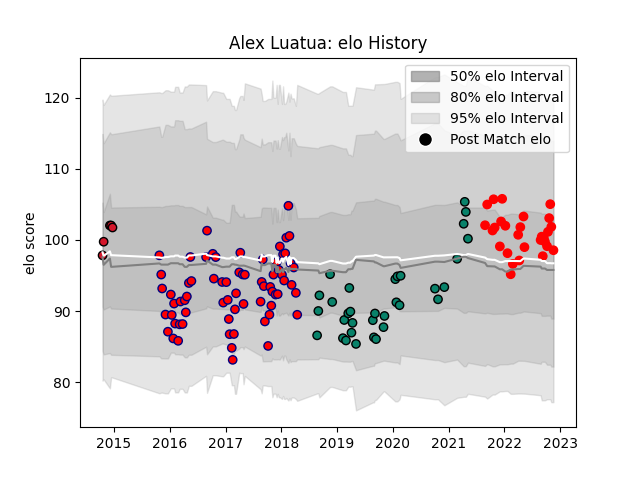

---  
layout: page  
title: Alex Luatua  
date: 2022-12-09 13:10:18.560551  
categories: player  
---
# Alex Luatua

## Positions: C, W

## Current elo: 98.0

## Current Percentile: 57.0

# Elo History

# Match History

| Team      |   Appearances |   Win Rate |
|:----------|--------------:|-----------:|
| Aurillac  |            69 |   0.485507 |
| Montauban |            33 |   0.454545 |
| Rouen     |            30 |   0.416667 |
| Oyonnax   |             5 |   0.6      |

| Opponent                   |   Matches |   Win Rate |
|:---------------------------|----------:|-----------:|
| Mont-de-Marsan             |         9 |   0.333333 |
| Vannes                     |         9 |   0.555556 |
| Beziers                    |         9 |   0.444444 |
| Biarritz Olympique         |         8 |   0.625    |
| Soyaux-Angouleme           |         8 |   0.6875   |
| Carcassonne                |         8 |   0.375    |
| Colomiers                  |         8 |   0.25     |
| Oyonnax                    |         7 |   0.357143 |
| Montauban                  |         6 |   0.416667 |
| Bayonne                    |         6 |   0.166667 |
| Provence Rugby             |         6 |   0.333333 |
| Dax                        |         6 |   0.5      |
| Perpignan                  |         6 |   0.5      |
| Nevers                     |         5 |   0.2      |
| Agen                       |         4 |   0.25     |
| Massy                      |         4 |   0.75     |
| Grenoble                   |         4 |   0.5      |
| Brive                      |         4 |   0.75     |
| Narbonne                   |         3 |   0.666667 |
| Bourgoin-Jallieu           |         3 |   0.333333 |
| US Bressane                |         3 |   0.166667 |
| Albi                       |         2 |   1        |
| Aurillac                   |         2 |   1        |
| Lyon                       |         1 |   0        |
| Gloucester Rugby           |         1 |   0        |
| Rouen                      |         1 |   1        |
| Roval Drome XV             |         1 |   1        |
| Tarbes                     |         1 |   1        |
| Valence Romans Drome Rugby |         1 |   1        |
| Zebre                      |         1 |   1        |