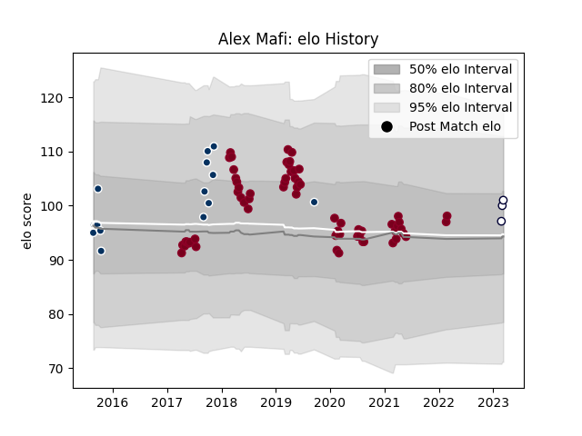

---  
layout: page  
title: Alex Mafi  
date: 2023-03-21 18:39:22.099012  
categories: player  
---
# Alex Mafi

Last updated: 2023-03-21
## Positions: H

## Current elo: 99.0

## Current Percentile: 69.0

# Elo History

# Match History

| Team               |   Appearances |   Win Rate |
|:-------------------|--------------:|-----------:|
| Queensland Reds    |            63 |   0.468254 |
| Queensland Country |            16 |   0.5      |
| Melbourne Rebels   |             4 |   0.25     |

| Opponent                 |   Matches |   Win Rate |
|:-------------------------|----------:|-----------:|
| New South Wales Waratahs |        11 |   0.454545 |
| Brumbies                 |        11 |   0.545455 |
| Melbourne Rebels         |        10 |   0.65     |
| Sunwolves                |         5 |   0.8      |
| Western Force            |         5 |   0.4      |
| Chiefs                   |         4 |   0        |
| Crusaders                |         3 |   0        |
| Bulls                    |         3 |   0.666667 |
| Canberra Vikings         |         3 |   0.333333 |
| Blues                    |         3 |   0.333333 |
| Jaguares                 |         2 |   0        |
| Lions                    |         2 |   0.5      |
| Brisbane City            |         2 |   0.5      |
| Melbourne Rising         |         2 |   0.5      |
| Highlanders              |         2 |   0        |
| Sharks                   |         2 |   0.5      |
| Stormers                 |         2 |   0.5      |
| Sydney Rays              |         2 |   0.5      |
| NSW Country Eagles       |         2 |   1        |
| Hurricanes               |         1 |   0        |
| Greater Sydney Rams      |         1 |   1        |
| North Harbour Rays       |         1 |   0        |
| Perth Spirit             |         1 |   0        |
| Southern Kings           |         1 |   1        |
| Fiji                     |         1 |   1        |
| Sydney Stars             |         1 |   0        |