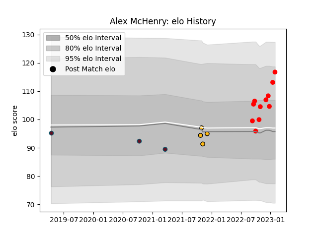

---  
layout: page  
title: Alex McHenry  
date: 2023-02-02 18:42:48.416442  
categories: player  
---
# Alex McHenry

## Positions: C

## Current elo: 117.0

## Current Percentile: 84.0

# Elo History

# Match History

| Team    |   Appearances |   Win Rate |
|:--------|--------------:|-----------:|
| Jersey  |            11 |   0.863636 |
| Wasps   |             4 |   0.25     |
| Munster |             3 |   1        |

| Opponent            |   Matches |   Win Rate |
|:--------------------|----------:|-----------:|
| Benetton Treviso    |         2 |       1    |
| Cornish Pirates     |         2 |       1    |
| Coventry            |         2 |       0.75 |
| Ampthill            |         1 |       1    |
| Bath Rugby          |         1 |       1    |
| Bedford             |         1 |       1    |
| Doncaster           |         1 |       1    |
| Ealing Trailfinders |         1 |       0    |
| Edinburgh           |         1 |       1    |
| Harlequins          |         1 |       0    |
| Hartpury College    |         1 |       1    |
| London Scottish     |         1 |       1    |
| Richmond            |         1 |       1    |
| Saracens            |         1 |       0    |
| Worcester Warriors  |         1 |       0    |