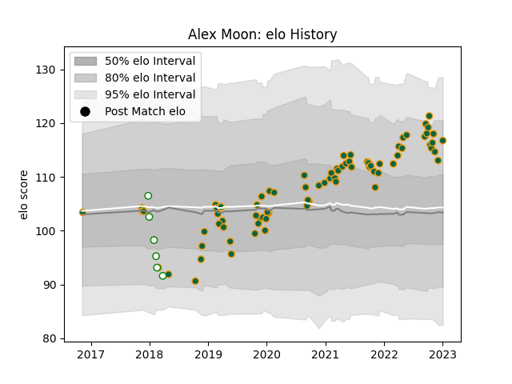

---  
layout: page  
title: Alex Moon  
date: 2022-11-22 11:44:33.421499  
categories: player  
---
# Alex Moon

## Positions: L

## Current elo: 102.0

## Current Percentile: 78.0

# Elo History

# Match History

| Team               |   Appearances |   Win Rate |
|:-------------------|--------------:|-----------:|
| Northampton Saints |            75 |   0.506667 |
| Nottingham         |             6 |   0.166667 |

| Opponent            |   Matches |   Win Rate |
|:--------------------|----------:|-----------:|
| Exeter Chiefs       |         8 |   0.25     |
| Sale Sharks         |         8 |   0.25     |
| Bath Rugby          |         7 |   0.428571 |
| Bristol Rugby       |         7 |   0.428571 |
| Wasps               |         7 |   0.714286 |
| Leicester Tigers    |         6 |   0.5      |
| Gloucester Rugby    |         5 |   0.6      |
| Harlequins          |         5 |   0.4      |
| London Irish        |         5 |   1        |
| Saracens            |         4 |   0.25     |
| Worcester Warriors  |         3 |   0.666667 |
| Clermont Auvergne   |         2 |   0        |
| Dragons             |         2 |   1        |
| Benetton Treviso    |         2 |   1        |
| Newcastle Falcons   |         2 |   1        |
| Lyon                |         1 |   1        |
| Hartpury College    |         1 |   0        |
| London Scottish     |         1 |   0        |
| Leinster            |         1 |   0        |
| Ealing Trailfinders |         1 |   0        |
| Doncaster           |         1 |   0        |
| Cornish Pirates     |         1 |   1        |
| Yorkshire Carnegie  |         1 |   0        |