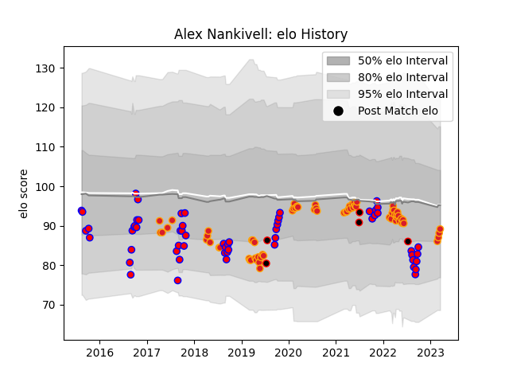

---  
layout: page  
title: Alex Nankivell  
date: 2023-03-21 18:07:31.906603  
categories: player  
---
# Alex Nankivell

Last updated: 2023-03-21
## Positions: C

## Country: New Zealand Maori

## Current elo: 89.0

## Current Percentile: 28.0

# Elo History

# Match History

| Team              |   Appearances |   Win Rate |
|:------------------|--------------:|-----------:|
| Chiefs            |            68 |   0.639706 |
| Tasman            |            58 |   0.646552 |
| New Zealand Maori |             5 |   0.6      |

| Opponent                 |   Matches |   Win Rate |
|:-------------------------|----------:|-----------:|
| Hurricanes               |        11 |   0.5      |
| Crusaders                |        10 |   0.5      |
| Blues                    |         8 |   0.5      |
| Canterbury               |         7 |   0.142857 |
| Taranaki                 |         7 |   0.857143 |
| Auckland                 |         6 |   0.5      |
| North Harbour            |         6 |   0.75     |
| Waikato                  |         6 |   0.666667 |
| Highlanders              |         5 |   0.6      |
| Moana Pasifika           |         5 |   1        |
| Hawke's Bay              |         5 |   0.6      |
| Wellington               |         5 |   0.8      |
| Southland                |         4 |   1        |
| Queensland Reds          |         4 |   0.75     |
| New South Wales Waratahs |         4 |   1        |
| Brumbies                 |         4 |   0.5      |
| Otago                    |         3 |   0.333333 |
| Sunwolves                |         3 |   0.666667 |
| Counties Manukau         |         3 |   0.666667 |
| Jaguares                 |         3 |   0.333333 |
| Melbourne Rebels         |         3 |   1        |
| Northland                |         3 |   1        |
| Samoa                    |         2 |   1        |
| Manawatu                 |         2 |   0.5      |
| Fiji                     |         2 |   0.5      |
| Western Force            |         2 |   1        |
| Bay of Plenty            |         1 |   1        |
| Lions                    |         1 |   0        |
| Sharks                   |         1 |   1        |
| Ireland                  |         1 |   0        |
| Stormers                 |         1 |   0        |
| Fijian Drua              |         1 |   1        |
| Cheetahs                 |         1 |   1        |
| Bulls                    |         1 |   1        |